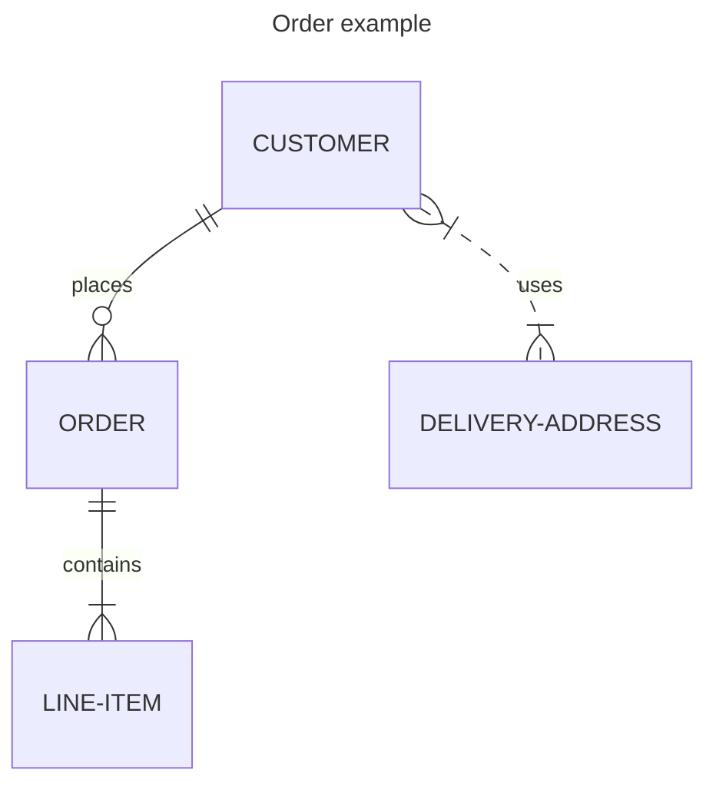
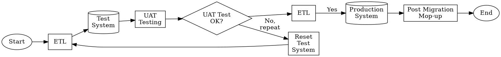

**Data Architecture**

**[project]**

**Document Id: [Use SharePoints Document Id]**

**Version: [Use SharePoints Document Versioning]**

*[This template is based on a hypothetical system upgrade, which means that there is an AS-IS and a TO-BE aspect, so that the impact and business and technology can clearly be understood once this design is implemented. If this were to be a brand new system, there would not be an AS-IS section. The hypothetical design consists of a client-server project that consists of database servers, internet servers and development-support servers, with three environments: DEV, UAT+TEST and PROD, all on virtual networks. The servers are for now modelled as on premise VMs here, but could just as easily be applied to a cloud-based solution.*

*This document is written in GitHub-standard Markdown scripts and uses the following plugins for viewing the correctly-rendered output in Visual Code's Mark Down Preview:*
  
- *"Mermaid" for various diagram types*
- *"GraphViz" DOT diagram notation for other diagram types not supported by Mermaid*

Add FontAwesome to Mermaid diagrams like this:

YOu need this file: settings.json
{
"markdown.styles": [
    "https://use.fontawesome.com/releases/v5.7.1/css/all.css"
],
}

In the Mermain script:

*Note that the Version number and the Document Identity fields should be set up in your word processor to automatically update when this document is checked back into SharePoint, or whatever doument management system you are using.
Remove all comment sections in italics before final presentation.]*

**Document Details**

Document Identity:  *[Unique Identifier that your Document Management System had issue this document]*

**Approvals**

|Role      |Name   |Title                       |Date|
|----------|-------|----------------------------|----|
|Originator|       |DATA ARCHITECT              |    |
|Approver  |       |SYSTEM DESIGN AUTHORITY     |    |
|Approver  |       |ASSISSTANT PROJECT MANAGER  |    |
|Approver  |       |SOFTWARE DEVELOPMENT MANAGER|    |
|Approver  |       |SOFTWARE FUNCTIONAL MANAGER |    |
|Reviewer  |       |QUALITY ASSURANCE           |    |
|Authoriser|       |ENTERPRISE ARCHITECT        |    |

**Distribution**

|Name|Copy|Number|
|----|----|------|
|    |    |      |
|    |    |      |
|    |    |      |
|    |    |      |

  
**Document Version History**

|Version|Date|Author|Details|
|-------|----|------|-------|
|       |    |      |       |
|       |    |      |       |
|       |    |      |       |
|       |    |      |       |
|       |    |      |       |

**Preceeding Documents**

*[Important: Do not proceed with this documents until these documents have been drafted]*

|Document                     |Version|Date|Author|
|-----------------------------|-------|----|------|
|Business Reqirements         |       |    |      |
|Non-Functional Specifications|       |    |      |

    
  
**Definitions and Abbreviations**

*[A list of useful acronyms and abbreviations that are referred to in this this document. Remove superflous ones.]*

|Acronym |Description|See also|
|--------|-----------|---------|
|ACID    |Data Transaction Properties: Atomicity, Consistency, Isolation, and Durability|SQL|
|AVRO    |Binary-encoded JSON-based data format, preferred format for serialising record data for streaming. Also used in Big Data, although uses a row-based storage approach|Parquet,CSV| 
|BASE    |Basic Availability, Soft State, Eventual Consistency|CAP,ACID|
|Big Data|Too large or complex data to be dealt with using conventional means||
|CAP     |A design trade-off in distributed system design: Consistency, Availability, Partition tolerance|BASE,ACID|
|CCPA    |California Consumer Privacy Act|GDPR|
|CDC     |Change Data Capture
|CI      |Configurable Items, as found in a CMDB|CMDB|
|CICD    |Continuous Integration and Continuous Deployment|
|CMDB    |Configuration Management Database|CI|
|CRUD    |The 4 standrd data operations: Create, Read, Insert and Delete|SQL|
|CSV     |Comma-delimited String Value row-oriented data file format|Parquet, Iceberg|
|Data Fabric|A methodology and architectural approach to break down siloed data by typically virtualizing all data and so make it accessible to the right consumers, and to manage its life cycle||
|Data Lake|An unstructured store of the enterprise's raw and unprocessed data.|Date Warehouse, Date Lakehouse|
|Data Lakehouse|A store of structured, semi-structured and unstructured enterprise data with easy access to all data, transactioning and indexing.|Data Lake, Data Warehouse|
|Data Mart|A partition of the enterprise's data warehouse that only specializes on a particular aspect of the business|Data Warehouse|
|Data Mesh|A methodology to fluidize data access. Not ready for use yet.|Data Fabric|
|Data Pipeline|The route from data's create, collect, ingest, store, transform, compute and consumption, in either a streamed or a batched mode. This does not include discrete approaches like event-based integrations (ReST API etc...). |ETL, ELT|
|Data Warehouse|A structured store of the enterprise's data. Structured data can be in a table schema of facts (aggregates) and dimensions (details) for convenient analytics, or in a normalized schema for operational systems.|Data Mart, Data Lake|
|Delta Lake|An additional layer to make Data Lakes ACID compliant, and offers schema enforcement and time travel|ACID, Data Lake|
|DSAR    |Data Subject Access Request|GRPD, CCPA|
|ETL     |Extract Transform Load data process on a batched basis|ELT, Data Pipeline|
|ELT     |The process to Extract Load streamed data and then Transform it|ETL, Data Pipeline|
|GDPR    |General Data Protection Regulation|DSAR, CCPA|
|HIPAA   |Data compliance regulation in Healthcare|PCI/DSS|
|Iceberg |High-performance data file format for analytics and data lakes|CSV, Parquet, AVRO, ORC|
|JSON    |JavaScript Object Notation for schemaless data interchange|YAML|
|LLM     |Large Language Model (AI)|RAG|
|MDM     |Master Data Management, which creates a single source of truth for business-critical data||
|NLP     |Natural Languauge Processing |RAG|
|NoSQL   |A schemaless database paradigm that holds semi-structured sata such as emails, JSON, XML & HTML and other document files, which is harder to retreive and manipulate. NoSQL databases scale horizontally.|SQL|
|ORC     |A Optimized Row Columnar data file format, used in Big Data|CSV,Iceberg,Parquet,AVRO|
|Parquet |A columnar data file format, used in Big Data, especially nested data|CSV,Iceberg,ORC,AVRO|
|PCI/DSS |Data compliace regulation|HIPAA|
|PII     |Personally Identifiable Information|GDPR|
|RAG     |Retrieval-Augmented Generation, an architectural approach for improving accuracy of an LLM in AI|LLM|
|ROPA    |Record of Processing Activities - to be produced for GDPR compliance|GDPR|
|RDBMS   |Relational Dtaabase Management System||
|Schema  |The blueprint that defines the logical structure and organization of the data||
|Schema-on-Read|The data schema is created and imposed as data is read from a data lake|Data Lake|
 Schema-on-Write|The structured data schema is created *before* data is ingested into a data store, typically an RDBMS|RDBMS|
|SQL     |Search Query Language, a langauge used for creating statements that create, read, insert and delete data from structured data databases.|NoSQL, CRUD|
|Unstructured Data|Schemaless, formatless data that cannot easily be queried, manipulated or analyzed and is stored in its native format, e.g. documents, audio, video, social media posts. Requires specialist tools.||
|Vector Search|NLP technique to find nearest matching strings, images, audio, video, and other unstrutured data sets|NLP|
|YAML    |A human-readable (as opposed to JSON) data serialization language|JSON|

**Table of Content**

**Table of Content**

*[Add your word processor's TOC link in here - it should look something like this, which was generated in MD using the "Auto Markdown TOC" by Hunter Tran:]*
*[To update these indexes, Right-click on each list and select “Update entire table”.]*

<!-- TOC -->

<!-- TOC -->

**List of Figures**

*[Add your word processor's TOC link in here]*

**List of Tables**

*[Add your word processor's TOC link in here]*
 

# Scope

## Identification

This [project] is a [functional description].

## The Function of Data Architecture

A solid data architecture is important to ensure smooth digitial transformations and new application implementations, since every aspect of a system is underpinned by data. 
The better the data quality and the better the data connections between system components, the better the system experience and the easier it is to automate processes, reports on business aspects, gain insights and predict trends and make decisions. Data Architecture is both an art form and a science for connecting, manageing and democratizing data to enable automation, self-service reporting, data-led decision-making and the creation of new business opportunities.

**A good data architecture delivers the following:**

* Ensure one version of the truth and a consistent meaning and context of data across the enterprise.
* Good connectivity to the data stores. Without connections, the data is meaningless to the business.
* A scalable strategy that handles increasing data volumes and data computations.
* Good data quality, that is sufficiently complete and meaningful for the business's purposes, yet is not duplicated nor ambiguous, and serves as the single source of truth for the business. 
* Data is represented in a consistent format and can be described and categorized using business terminology.
* A governing function for people-based rules and automated processes to ensure data quality, compliance, ownership, accountability, cleansing, standardization, categorization and security and privacy.
* Data Architecture acts as interface between the IT project delivery function and the business stakeholders.

**Why do we need a data strategy?**

Managing Data Assets is challenging and needs a strategy to keep data under control. Consider these points:

1. We need a strategy to democratize our data by advertizing the business meanings of it and making it accessible to our data-literate business colleagues without the explicit involvement of IT specialists, in order to foster a data-driven business culture and empower employees. Contrary to this, we need to protect our data by ensuring its integrity, privacy and security, limit data access, control its use and desensitize/depersonalize data where required. We therefore need to strike a balance between the value that is created from data democratization and the risk suffered from misusing such data. 

2. We need a strategy to realize the value of our data by understanding how data contributes to achieving our business goals. We can achieve our business goals by:
  *  Automation of business processes (a.k.a. "Do things faster")
  *  Use of anaylics to explore new ays of doing things (a.k.a. "Do things better")
  *  Creation of improved user experiences at scale (a.k.a. "Personalize experience to the individual, not some demographic user segment")
  *  Commercializing Data Products for internal or external use (a.k.a. "Package up data to make it useful to others")

3. We need a strategy to manage data as a asset by understanding the required data quality, structure and data processes. We do this by:  
  * Data discovery and documentation
  * Assigning Data Ownership, Stewardship and Accountability
  * Implementing Master Data Management
  * Implementing data quality control

In summary, a data strategy helps us Understand, Manage, Protect and Leverage our data and sets the foundations for the business's critical capabilities. 

## Document Purpose 

The purpose of this Data Architecture Document (DAD) is to describe the designed strategy and architecture applied to the [project], 
in terms of data management principles, governance policies, privacy, security and acccess control. Specifically, this document provides:

* A description of the contextual, conceptual and logical data models that holds the core information objects that support the intended application, with guidances on how the physical models would need to be constructed, where appropriate.
* The high level approach used to exploit the data models in the targeted solution to achieve a seamless data flow and timely delivery, as described by the non-functional requirements.
* An overview of all the transformations that the data will undergo as it traverses through its data pipeline.
* Specifications of what constitutes acceptable data quality and the approaches that will be used to achieve that data quality
* A summary of all automation processes that relate to the initial data take-on, preparation, ongoing management, rationalization, cleansing and transmission of data though the system, limited to the scope of the [project].
* An overview of reports (tabular and graphic) that will be produced as part of the overall solution, and a brief overview of any reporting tools used to produce these.
* An overview of the types of data analysis and data science-based business intelligence that will be performed on the data
* The high level design of how security is implemented at a data level, as opposed to the security at a network of application level
* A classification of what data belongs into the enterprise’s data classification scheme
* Backing up and data vaulting strategies
* Recoverability strategies on loss of data

## Document Scope 

This document presents the data-related aspects of the [project].

## Overview 

This DAD will: 

* Present the data-oriented design aspects and define them 
* Describe the Configurable Items (CI) being implemented
* Describe the software interfaces
* Describe the performance 
* Include design features and the architecture of the project
* Describe attributes of the data architecture that relate to non-functional requirements specified in the NFR:
** Security
** Safety
** Performance
** Data life cycle, from creation to disposal

## Intended Audience 

The target audience for this document includes business, technical and non-technical, governance, and project management stakeholders. Specific users of this document include solution architects, data architects, developers and test analysts. This DAD uses technical terms which should be understandable to the indicated audience.
 

# Data Architecture Design Decisions

The table below identifies key design decisions that were specifically made regarding the data architecture in the [] product. These decisions were made in conjunction with SQEP individuals to ensure agreement across all contributors to the product stack, and complement the overall design set out in the HLD Solution Architecture.

|ID Number|Decision|
|---------|--------|
|DD-01    |        |
|DD-02    |        |

_Table 1 Data Architecture-specific decisions_

The design from the Solution Architecture HLD and the design decisions taken from Table 1 above are used to shape the data architecture below.

The decision rationale is based on the following:

## Limits of legacy database vs new database

*[Describe limits in the legacy database that were relevant in choosing in choosing the new database, if any.]*

Consider the following trade-offs:

Limit on horizontal scaling
Transactionability and ACID compliance
Database modelling and flexibility

## Benchmarking comparissons

## Choice of Database type and vendor

## Alterntive approches explored with legacy database 

[In the case of a database upgrade, what alternative remedies have been explored, and why were they not implemented instead?]

* Vertical server scaling by upgrading memory or processors
* Horizontal scaling by sharding the database or replicating to multiple read-only instances
* Disk I/O too slow, or too much Disk I/O instead of in-memory processing
* Possible database configuration changes considered
* Database tuning: Table design, indexed, compaction strategies, garbage collections, memory usage, stored procedure fine-tuning
* Storage partitioning schemes to physical storage devices
* Network tuning
* Cache the database front-end
* Experts and vendors consulted?

# Contextual Data Architecture

The contextual data model and data pipeline describes how data is mapped to the business activities to meet the business requirements and flows through the application [Ref. 1]. The sources of external data and internal data generation are described here too.

    *[Figure: AS-IS Conceptual data diagram: Customer order fulfillment-      ]*

# Conceptual Data Architecture

##   Overview

Here we enumerate the high-level data entities that support the application, and how they relate to one another in terms of their cardinality. 
[At this stage, row details are not included since they will be shown in the eventual data model.]

# Logical Data Architecture

##   Overview

This section describes the data structures used where structured data is used in the application, e.g. normalised, dimensional, and hierarchical, key-value pairs, streamed data, time-series data and images and documents. Any pertinent characteristics in unstructured data used by the application are also enumerated here.

[Examples:]

Figure: Event Management database design

Figure: Content Management database design

Figure: Logging database design

# Physical Data Architecture

##   Overview

This section describes the physical implementation of the databases, whether the databases is cloud-hosted or on premise hosted. This entails enumerations of the database management systems used in the application, data storages, file systems, directory structures, and any special features offered by the database system in use. Aspects such as table partitioning, data sharding, and other techniques used for distributing data are also described here. Furthermore, aspects of the physical data architecture that relate to disaster recovery (DR), backing up and restoring, and data vaulting and disposal are also described here. 

## Vendor choices

*[Describe the choice of vendor based on technical capability to meet the data requirements for this application.]*

Rank|Database
----|--------
1|Oracle
2|MySQL
3|SQLServer
4|PostgreSQL
5|MongoDB
6|Redis
7|Snowflake
8|Elasticsearch
9|Db2
10|SQLite
11|Cassandra
12|Access
13|Splunk
14|Databricks
15|MariaDB
16|Azure SQL
17|Amazon DynamoDB
18|Apache Hive
19|Google BigQuery

**AirTable**

- Paradigm: 
- Features:
- Powered by:
- Tools:
- Access:
- Use case
- Tools:
- Similar to: 

**Astra DB**

> Fast release cycle

- Paradigm: Big Data, NoSQL,
- Features: serverless, high availability, zero downtime, Vector processing, extreme performance, global scalability, clustering
- Powered by: 
- Tools:
- Access: C++, Node, Python, Java
- Use case: AI, RAG, Real-time apps
- Tools:
- Similar to: Cassandra

**base**

- Paradigm: 
- Features:
- Powered by:
- Tools:
- Access:
- Use case
- Tools:
- Similar to: 

**Big Data**

- Paradigm: 
- Features:
- Powered by: Google
- Tools:
- Access:
- Use case
- Tools:
- Similar to: 

**Cassandra**

> Prioritizes performance over storage. Denormalization is good practice. No joins. 

- Paradigm: Big Data, NoSQL 
- Features: serverless, high availability, zero downtime, vector processing, extreme performance, global scalability, clustering
- Powered by: Java, which is slower than C++
- Tools:
- Access: Cassandra Query Language (CQL), much like SQL
- Use case: NetFlix architecture, write-intensive apps (IOT sensors, streaming and log data), time series data, recommendation engines
- Tools:
- Technologies: Distributed architecture
- Similar to: Scylla DB (better, faster, more scalable), Astra DB (vector search)

**CloudFlareD1**

- Paradigm: 
- Features:
- Powered by:
- Tools:
- Access:
- Use case
- Tools:
- Similar to: 

**Cosmos DB**

- Paradigm: NoSQL
- Features: Geographic scaling & replication
- Powered by: Azure 
- Tools:
- Access: API
- Use case: Mixture of multiple types of data models
- Features: Low latency and high availability
- Tools:
- Similar to: MongoDB, DynamoDB

**Couchbase**

- Paradigm: Document oriented key-value store, memory-based
- Features: Combines document oriented with key-value store in memory, global replication
- Powered by:
- Tools:
- Access:
- Use case: Content managem systems, e-commerce
- Tools:
- Similar to: 

**CouchDB**

- Paradigm: Document oriented key-value store, memory-based
- Features: Data consitency without locking, eventual consistency
- Powered by:
- Tools:
- Access: ReST API
- Use case: Content managem systems, mobile applications
- Tools:
- Similar to: 

**DB2**

- Paradigm: 
- Features:
- Powered by:
- Tools:
- Access:
- Use case
- Tools:
- Similar to: 

**Dolt**

- Paradigm: 
- Features:
- Powered by:
- Tools:
- Access:
- Use case
- Tools:
- Similar to: 

**DuckDB**

- Paradigm: Columnar RDBMS
- Features: In-process, portable, small, high performance
- Powered by: C++
- Tools: CLI client, API
- Access: Rich SQL and API
- Use case: Analytics Apps that require an in-process DB
- Tools: C++ compiler
- Similar to: SQLite
- Supports: Parquet, JSON, flatfiles, HTTPS- & S3 protocols

**DynamoDB**

- Paradigm: NoSQL, Document and Key-value
- Features: Key-Value data store, "limitless" geographic scalability, low latency high availability, high durability, serverless
- Powered by: Amazon
- Tools:
- Access:
- Use case: Document-oriented data models, IoT
- Tools:
- Similar to: MongoDB, Cosmos DB

**EdgeDB**

- Paradigm: 
- Features:
- Powered by:
- Tools:
- Access:
- Use case
- Tools:
- Similar to: 

**ElasticSearch**

- Paradigm: Document-oriented Search Engine
- Features: sharding, replication
- Powered by:
- Tools:
- Access: ReST Interface
- Technology: Apache Lucene
- Use case: Full text searching
- Tools:
- Similar to: 

**Fauna**

- Paradigm: 
- Features:
- Powered by:
- Tools:
- Access:
- Use case
- Tools:
- Similar to: 

**Firestore**

- Paradigm: 
- Features:
- Powered by:
- Tools:
- Access:
- Use case
- Tools:
- Similar to: 

**FoundationDB**

- Paradigm: 
- Features:
- Powered by:
- Tools:
- Access:
- Use case
- Tools:
- Similar to: 

**Google Big Query**

> Large scale data warehouse service with append-only tables

- Paradigm: append-only tables
- Features: No transactioning. no foreign keys
- Powered by: 
- Tools: Programming languages
- Access: ReST HTTP/JSON API
- Use case: Large scale data warehouses
- Tools: 
- Similar to: 

**HBase**

- Paradigm: Wide-column store
- Features: Auto-sharding, regional distribution, good consistency
- Powered by: Apache
- Tools:
- Access: Hadoop integration
- Use case: Data warehouse
- Tools:
- Similar to: BigTable

**InfluxDB**

- Paradigm: Key-value
- Features:
- Powered by:
- Tools:
- Access:
- Use case
- Tools:
- Similar to: 

**iSQL**

- Paradigm: 
- Features:
- Powered by:
- Tools:
- Access:
- Use case
- Tools:
- Similar to: 

**Kafka**

- Paradigm: 
- Features:
- Powered by: Java & Scala
- Tools:
- Access: Subscribtion to topic, streams API
- Use case: Streaming applications, log analysis, machine-learning pipeline, system monitorning and alerting, replaying incidents for root cause analysis, data change capture, gradual legacy system migrations, 
- Tools:
- Similar to: 
- Features: fault tolerant, scalable, high throughput, pub/sub model for fanning selected data out. persistence

**KeyDB**

- Paradigm: Key-value store
- Features: Faster alterntive to Redis
- Use case: In-memory distributed cache

**MariaDB, MySQL**

- Paradigm: RDBMS
- Serverless platforms: PlanetScale, 
- Sharding solutions: Percona, SingleStore
- Powered by: B-Tree
- Tools: Prisma
- Access: ODBC etc..

**MemCache**

- Paradigm: 
- Features:
- Powered by:
- Tools:
- Access:
- Use case
- Tools:
- Similar to: 

**MemGraph**

- Paradigm: Graph database
- Similar to: Wire-compatible with Neo4j
- Use case: Real-time hierarchical analytics, Holding duplicated data for quick search
- Technology: Powered by: C++
- Features: Memory-first architecture, more performant
- Access: 

**MeiliSearch**

- Powered by: Rust
- Use case: Holding duplicated data for quick search
- Similar to: 
- Technology: 
- Features: 
- Access: 

**MindsDB**

- Paradigm: AI-tables used to imbed predictive models directly into a database
- Use case: Integrate learning frameworks
- Similar to: 
- Technology: 
- Features: 
- Access:  

**MongoDB**

- Paradigm: Document oriented
- Similar to: Cosmos DB, DynamoDB
- Use case: Document-oriented data models, content management systems, catalog management
- Technology: BSON format
- Features: Schemaless design, HA, sharding, replication
- Access: 

**Neo4j**

- Paradigm: Graph database, with edges and entities
- Similar to:  
- Powered by: Java
- Access: Cypher Query Language (CQL)
- Use case: Gold standard for graph databases, recommendation engines, social networking, social media analytics, AI knowledge graphs, fraud detection, 
- Features: ACID, HA, clustering
- Access: SQL-like Cypher

**Neon**

- Paradigm: 
- Similar to: PostGres
- Use case: 
- Technology: Rust
- Features: Data branching a la Git
- Access: 
- Serverless platform: YugabyteDB, Dolt 
- Sharding solutions: 

**Notion**

- Paradigm: 
- Similar to: 
- Use case: 
- Technology: 
- Features: 
- Access: 

**Oracle**

- Paradigm: Enterprise RDBMS
- Similar to: 
- Use case: 
- Technology: 
- Features: 
- Access: 

**Planet**

- Paradigm: Multi-Cloud-based PostGres
- Similar to: PostGres
- Use case: 
- Technology: 
- Features: 
- Access: 
- Serverless platform: 
- Sharding solutions: 

**PostGres**

- Paradigm: 
- DB Type: OLAP with ACID & relations & transactionining
- Similar to: 
- Use case: 
- Technology: 
- Features: Data branching (Neon & Dolt) a la Git
- Access: SQL
- Serverless platform: YugabyteDB, Neon, Dolt 
- Sharding solutions: Neon, Dolt
- Extensions: Timescale time series DB

**Presto**

- Paradigm: 
- Similar to: 
- Use case: 
- Technology: 
- Features: 
- Powered by:
- Access: 

**Pulsar**

- Paradigm: 
- Similar to: 
- Use case: Message Queueing 
- Technology: 
- Features: 
- Powered by:
- Access: 

**Redis**

- Paradigm: Key-Value and Object store
- Similar to: MemCache
- Use case: Cache, session management, gaming leaderboards
- Technology: In-memory storage
- Features: Persistent storage, complex data structures, vector searches
- Powered by:
- Access: 

**Redshift**

- Paradigm: 
- Similar to: 
- Use case: 
- Technology: 
- Features: 
- Powered by: Amazon
- Access: 

**RocksDB**

- Paradigm: 
- Similar to: 
- Use case: 
- Technology: 
- Features: 
- Powered by: LSM Tree
- Access: 

**Scylla DB**

> Better than Cassandra

- Paradigm: Big Data, NoSQL
- Similar to: Wire-compatible with Cassandra
- Use case: 
- Technology: C++, so no garbage collection
- Features: Highly scalable, very low latecy (15ms)
- Handles high volume of write operations - even higher than Cassandra
- Open source
- Access: C++, Rust

**SingleStore**

> - 100 times faster than MariaDB
> - Better concurrency than MariaDB

- Paradigm: Distributed columnar RDBMS
- Similar to: MySQL/MariaDB (95% wire-compatible) and MongoDB (wire-compatible) and MemSQL
- Use case: analytics
- Technology: C++
- Features: Distributed, columnar, high speed batched and streamed data ingest, high performance query and search, vector support
- Supports: Connects to Kafka and other sources, Jupiter notebook, CDC from MySQL, MongoDB and PostgreSQL
- Powered by: Lucene Search
- Access: MySQL client, Python SDK
- Licence: Enterprise multinode, free single node

**Snowflake**

- Paradigm: Data Warehouse
- Similar to: 
- Use case: 
- Technology: 
- Features: SaaS
- Powered by: 
- Access: API

**Solr**

- Paradigm: NoSQL
- Similar to: 
- Use case: 
- Technology: 
- Features: 
- Powered by: 
- Access: 

**Spanner**

- Paradigm: 
- Similar to: 
- Use case: 
- Technology: 
- Features: 
- Powered by: 
- Access: 

**Spark**

- Paradigm: 
- Similar to: 
- Use case: 
- Technology: 
- Features: 
- Powered by: 
- Access: 

**SQLite**

- Paradigm: Key-Value and Object store
- Similar to: 
- Use case: transactional applications, apps that require in-process databases
- Technology: 
- Features: 
- Powered by: Google
- Access: 
- Cons: Weak data typing, poor session concurrency, deprecated by Google.

**SQL Server**

- Paradigm: Enterprise RDBMS
- Similar to: 
- Use case: 
- Technology: 
- Features: 
- Powered by: 
- Access: 

**Storm**

- Paradigm: 
- Similar to: 
- Use case: 
- Technology: 
- Features: 
- Powered by: 
- Access: 

**Superbase**

- Paradigm: 
- Similar to: 
- Use case: 
- Technology: 
- Features: 
- Powered by: 
- Access: 

**SurrealDB**

- Paradigm:  Multi-model, uses the best from all DBs, no joins but "record links"
- Similar to: 
- Use case: 
- Technology: 
- Features: ACID, fulltext, graph, schemaless, relational, geospatial, document
- Powered by: Rust
- Access: SQL-like with JS, Graph relate statements, ReST-API
- Platform: Self-hosted

**TimeScaleDB**

- Paradigm:  Time-series database
- Similar to: InfluxDB
- Use case: Time series data
- Technology: Cloud and On-Premise
- Features: ACID, relational, geospatial, partial aggregation, self-managed table partitioning  
- Powered by: 
- Access: Wire-compatible with PostGres

**TitaniumDB (TiDB)**

- Paradigm:  RDBMS
- Similar to: Wire-compatible with PostGress
- Use case: 
- Technology: 
- Features: ACID, fulltext, graph, schemaless, relational, geospatial 
- Powered by: Rust
- Access: SQL-like with JS, Graph relate statements, ReST-API

**Trino**

- Paradigm: 
- Features:
- Powered by:
- Tools:
- Access:
- Use case
- Tools:
- Similar to: 

**Xata**

- Powered by: 
- Wire-compatible: PostGres & Elastic Search
- Paradigm: Spreadsheet
- Features: Fulltext search, schema editor, data branching, serverless
- Access: SDK for Python and TypeScript
- Similar to: PostGres, Dolt DB (data branching)
  
Also see: Pinecode, Weaviate, Chroma, Qdrant, Milvus, Vespa, which feature vector searches.

## Reasons for using a different database

*[If there is a change of database from the AS-IS to the TO-BE, then here are are some good reasons why to support such a move.
Only select a new database if the problems are very difficult to fix. Account for database migration time. It is risky and costly. 
Are ACID transactional guarantees required in the design?]*

- Too much data and growing
- Growing Latency
- Excessive Disk I/O
- Insufficient amount of memory
- Can the existing DB be configured to fix these problems / give more breathing room?
- Can the life be extended by adding a cache, or a replication scheme, or data sharding, or apply another partitioning scheme?

##   Data Volumetrics

*[Repeat for each component that undergoes significant data ingress and eggress.]*

Table x lists the estimated data traffic for the database in a typical production setting for reading and writing data by the component [A]. This is useful when determining storage design and network design, and ultimately in the database design where incoming streamed data could possibly get lost if it can’t handle the influx.

|Operation|Transactions per Second (TPS)|Data volume per transaction in KB|Data volume per second (KB/s)|
|---------------------------------------|---------------------------------|-----------------------------|
|Insert|... KB/s|||
|Select|... KB/s|||
|Update|... KB/s|||
|Delete|... KB/s|||

Table x Estimated Data traffic for reading and writing data

Table x below shows the ratio between the read (select) and write operations (insert+update+delete). 

|Operation|R/W Ratio of Transaction|R/W Ratio of Data volume per transaction|
|---------------------------------------|---------------------------------|---|
|R/W Ratio|||

Table x: Read / Write Ratio for the estimated Data traffic 

*[Explain how these ratios were used to guide aspects of the data architecture.]*

## Physical tablespaces on the server

[Example: The back-end RDBMS is SQL Server 20XX SP2 and is hosted by SuccessionWealth in its data centre. The database holds configurations, user metrics and client content. The full-text search function is reserved for in the design but is not currently used.]

The tables below show the physical database architecture for all environments, where only one tablespace is used. There is no partitioning of any data tables.

Database Instance: [PROJECT]

Database: APPDB

|Storage|Mount|Size GB|%Growth|
|-------|-----|-------|-------|
|Data Tablespace 1|G:|||
|Indexes Tablespace 1|H:|||
|Data Log Tablespace 1|I:|||
|Table Partitions |None|N/A|N/A|
|Full-Text Search data  |K:|1G||
|Full-Text Search indexes|K:|1G||

Table x: Application database server mount points

Database: REPORTDB  

|Storage|Mount| Size GB|%Growth|
|-------|-----|--------|-------|
|Data Tablespace 1|G:|TBA||
|Indexes Tablespace 1|H:|TBA||
|Data Log Tablespace 1|I:|TBA||
|Table Partitions|None|N/A|N/A|
|Full-Text Search data|K:|TBA||
|Full-Text Search indexes|K:|TBA||

Table x Report Database server mounts  

Database: TEMPDB  
|Storage|Mount|Size GB|%Growth|
|-------|-----|-------|-------|
|Temp Data|J:|TBA||
|Temp Indexes|J:|TBA||

Table x: TempDB server mount points

## Data Storage Design

[This section describes the storage for:

1.  Structured data in the relational database:

* Table spaces on the RDBMS, if more that the default
* SAN Data tiering used for each table space on the RDBMS

2.  Unstructured data (documents, audio, images, video) typically makes for 80% of enterprise data. 

3.  Non-relational databases a.k.a. “no-SQL” databases, e.g. key-value stores, graph databases, document stores, column stores

4.  File systems for heterogeneous files.]

[Example for RDBMS storage:]

Server Node:  PVUKxxxyyySQL01 (Database server)

|Local/SAN|OS/Bin/Data/Page|FS|Mapping|Tier|Size(GB)|
|---------|----------------|--|-------|----|--------|
|SAN|OS|NTFS|C-drive|2|32|
|SAN|Page|NTFS|D-drive|2|8|
|SAN|Binaries|NTFS|E-drive|2|32|
|SAN|Application Data|NTFS|F-drive|2|32|
|SAN|DB Data|NTFS|G-drive|2|128|
|SAN|DB Indexes|NTFS|H-drive|2|32|
|SAN|DB Log|NTFS|I-drive|1|32|
|SAN|DB TempDB|NTFS|J-drive|1|32|
|SAN|DB Backup|NTFS|J-drive|3|128|
|SAN|Fulltext Search|NTFS|K-drive|1|32|

Table x: DEV Database server storage mounts

##   Initial Data Take-on

This solution does not require and initial data take-on.

##   Storage Volumetrics

Storage per schema and anticipated growth per annum

##   Data Storage scalability

[Statement on storage scalability, based on future-proofing requirements in the NFR.]

##   Data Replication

*[Describe the primary database and secondary database integration, role reversal scenarios, physical locations, connectivity, expected network latency
Is the replication synchronous (wait for the replication to complete before committing the transaction) or asynchronous (data is written to the secondary database after it is already committed on the primary server)?]*

## High Availability

*[Examples are Oracle RAC, High Availability via storage design, and servers on a clustered file system.]*

## Distributed System Design

*[Aspects of the distributed system design are considered here, if any. Possible server distribution approaches are data sharding a.k.a. fragmentation (each server holds a range of data e.g. geographic unit), multiple servers on a clustered file system, data replication at the storage level, e.g. on storage area networks (SANs) and on many cloud offerings.] *

## Data Interfaces

*[This section describes the high-level technical interfaces, data pipelines and user interfaces between the data stores, the applications, the middle-ware and the users. It should demonstrate how data can safely, speedily and readily be accessed by these components, and transferred in bulk between them. Any bespoke data services that are used for connectivity are described separately. The detailed technical descriptions for all data interfaces are described in the Interface Control Document (ICD). See Ref. 11.]*

## Data Services

*[This section describes the data services that exist to access the data from the application. Such services can either be via a function library such as ODBC, JDBC or DBLIB, web services such as ReSTful API or GraphQL, or vendor-bespoke data services as offered in the latest generation of data architectures like Snowflake and Kafka. Also for consideration here are any inter-database service procedure interfaces (SPIs).]*

## Information Architecture

*[This section describes and classifies the types of information that this application treats, the provenance of the information and the peripheral systems that intend to consume the information.]*

###   AS-IS Information Classes

*[Include this section if there is a change in the information classes]*

###   TO-BE Information Classes

[Example of data sets and the respective security classifications. Also indicate what type of operations will be performed to these data sets.]

|Data Type      |Source / Mastered by|Security Class|CRUD|
|---------------|--------------------|--------------|----|
|User Data      |LDAP                |Confidential  |R   |
|Process Events |Application         |Internal      |CR  |
|Parts Data     |                    |Secret        |R   |
|Search results |                    |Secret        |C   |
|               |                    |              |    |

*Table x: TO-BE Information architecture summary*

##   AS-IS Information Flows

[Include this section if there is a change in the information flow in the solution]

##   TO-BE Information Flows

[Example Figure of information flow between components]

Information flows include all information transfers between architectural components, and can be in the style of:

 - Batched, bulk data transfers
 - Streamed continuous data transfers
 - Discrete data transfers using any of a number of interprocess process communication protocols. 
 
The information flows are summarized and described in below in Table x below.

|Ref |Source  |Destination |Description |Frequency |Size| Batched/Streamed/API|
|----|--------|------------|------------|----------|----|---------------------|
|1   |Client A|Server B    |Client content data deployment|Daily|100KB|Batched|
|etc...||||||

*Table x: Information flows*

## Data Partner Services

No data is directly provided by other third-party data partners.
 

# Data Pipelines

# Data Pipeline Processing and Computation

## Introduction

Computation on the database itself are, for example, in-flight string manipulations, calculations, aggregations, execution of stored procedures. Other data based computations are performed on other external devices, such as data science-oriented operations, and machine learning (ML) and artificial intelligence (AI) operations such as pattern and image recognitions. As the size of the data grows, the capability of the database management system should also grow, and so should the computational data capability grow. 

The following processes are performed on the data pipeline:

• Data profiling
• Data cleansing
• Data enrichment
• General data processing

---

# Data Migration

**Summary:**

- Data migration often entails the movement and transformation of data between two differing data models
- Data migrations are difficult and is a poorly-understood discipline
- The greater the business change, the more complex and risky the data migration.
- Poor-quality source data risks data migration failure

## 1. Understand Source Data Quality in terms of existing structure, content and quality:
   - Data Profiling to identify missing values, inconsistent formats or outliers
   - Data Validation by running validation rules, that check for accuracy, value ranges, correct data types
   - Data Cleansing by removing wrong or irellevant content, correcting wrong values, deduplication, normalization, correcting errors identified duing profiling and validation

## 2. Understand the current AS-IS data model in terms of source entities, semantic meanings, relationships & attributes
   - Involve the BAs or Data Stewards / Data Owners of the source data   
   - Document your findings

## 3. Understand the target TO-IS data model in terms of source entities, semantic meanings, relationships & attributes
   - Involve the BAs or Data Stewards / Data Owners of the source data   
   - Show how source data needs to be structurally changed to fit into the target data model   
   - Consider storage requirements for the new data
   - Document your findings

## 4. Determine how data is manipulated on the target system compared to the source system   
Consider changes in business processes, data classifications, life cycles, new attributes and semantic meaning of the business entities. 
The recommended steps are:

### Establish a Business Glossary

A Business Glossary lists: 

   - Business actors 
   - Business entities 
   - Business states for these actors and entities
   
And then describe the differences:

   - Current definition and rules
   - New definition and rules

   
|Term       |AS-IS description  |AS-IS business rules  |TO-BE definition   |TO-BE business rules  |
|-----------|-------------------|----------------------|-------------------|----------------------|
|Lead       |*[old definition]* |*[old business rules]*|*[new definition]* |*[new business rules]*|
|Opportunity|                   |                      |                   |                      |
|Customer   |                   |                      |                   |                      |
|etc...     |                   |                      |                   |                      |

*Table x: AS-IS vs TO-BE Business Glossary*

### First round data mapping

   - Field-based mapping
   - Merge and split fields where required

### Second round data mapping
   - Apply definition and business changes as logic statements to the data map obtained thus far, to be applied in the transformation logic after data ingestion.

## The ETL 

The Extraction, Loading and Transformation process typically consists of these steps:

```graphviz
digraph ETLProcess {
   rankdir=LR;
   size="10,5";
   
   ETL0 [shape = cylinder, label="Source"];
   ETL1 [shape = rarrow, label="Source\nExtraction"];
   ETL2 [shape = cylinder, label="Landing\nArea"];
   ETL3 [shape = rarrow, label="Data\nProfiling"];
   ETL4 [shape = folder, label="Profiling\nReport"];
   ETL5 [shape = rarrow, label="Data\nCleansing"];
   ETL6 [shape = cylinder, label="Staging\nArea"];
   ETL7 [shape = rarrow, label="Load to\nTaget"];
   ETL8 [shape = cylinder, label="Target\nArea"];

   
   ETL0->ETL1
   ETL1->ETL2
   ETL2->ETL3
   ETL3->ETL4
   ETL4->ETL5
   ETL5->ETL6
   ETL6->ETL7
   ETL7->ETL8
}
```

*Figure x: Stages of a typical ETL Process*

## High level Technical view of the Data Migration

*Figure x: A typical Technical Data Migration*

# Data profiling

**Use cases for data profiling:**

- Data migration, to move data between systems
- Data governance, which defines policies of managing data 
- Master Data Management, to maintain a single source of the truth
- Data Warehousing, for analytics and insights
- Compliance, to comply with laws and regulations

The objective of data profiling is to analyze and summarize the characteristic of data in terms of structure, quality and content. 
The following types of profiling need to be done:

- structure profiling: tables, keys, table relationships, column data types, volumetrics, stored procedures and rules
- quality profiling: reliability, completeless, accuracy, frequency, distribution, consistency (duplicates, mismatches), timeliness (freshness, currency)
- content profiling: meaning pattens, sequences, correlations, anomolies, frequencies, value distributions in columns, relationships between elements, summerizations, statistics and other aggregates for trends and seasonalities.

** Data profiling Process:**

A optimal profiling process would be as follows: 

1. Connecting to the data and extract it
   - Identify data sources
   - Ensuring access and permission to it
   - Set up a data landing area
   - Extracting the data 
2. Understand the data structure, volumes, growth projections
3. Explore source data to identify most important data. Statistical analysis to get distributions, counts, frequencies, spreads & tendencies.
4. Analyze source data quality for Accuracy, Completeness, Consistency, Reliability, missing values, outliers, inconsisten formats. Define data quality metrics.
5. Analyze data content for patterns, trends, correlations, data ranges, constraints
6. Document findings into Data Profiling report and a Data Structure Report

#   Data cleansing

No data on this application needs to have any incoming data to be cleansed.

#   Data enrichment

No data on this application needs to have any incoming data to be enriched.

#   Reconciliation

No data on this application needs to be reconciled.

#   General data processing

No further data processes to be performed on the data.

#   Data Computation scalability

[Statement on computation scalability on the database itself (in-flight string manipulations, calculations, aggregations, stored procedures), based on future-proofing requirements in the NFR.]

This section described how the computational ability of the installed system is allowed to grow as the needs for this increase. 

Possible approaches are:

* Vertical scaling: add more ram, processor cores, clock-speed, 
* Horizontal scaling: add more servers that run massively parallel processes (MPP), or run a map-reduce strategy. Describe how load balancing works and how the resources are negotiated. 
* Elastic scaling in the cloud: The cloud vendor will combine vertical and horizontal scaling approaches and will employ its own approach to resource allocation and load balancing.

# Distributed System Design for Computation

[Aspects of the distributed computation design are considered here, if any. Possible distributed computation approaches are the distributed Spark database or the Apache Impala distributed computation model. The now dated MapReduce approach, as offered by Hadoop et al is also a candidate for making the computational aspects of a database distributed. AI and ML operations can be farmed out to Cloud providers] 

# Data Security Architecture

## Introduction

Authentication, authorization and auditing (AAA) are the three pillars of data architecture security. This chapter describes each of these aspects from a high level point of view.

## Authentication 

[Discuss the type of authentication in use by users and processes: Either Password, LDAP, SSL, PPK, API bearer token, SSO, etc…]

This method by which either a user confirms its identity is performed using multi-factor authentication. 

This method by which either a client process confirms its identity is performed using an SSL certificate.

## Authorization

Authorization is the process that grants users or processes various levels of access to data, to carry out specific actions on data, i.e. create, retrieve, update and delete (CRUD), and also under which operational situations these authorizations apply, e.g. which use-cases, rules for specific environments. This may also be coupled with execution rights to specific programs that operate on the data.

###   Access control for data take-on

[Describe how to connect to for the various use-cases (e.g. engineer, admin, and operator) that will perform production operations]
[Roles and privileges to perform data take on]

|Use case|Role Name|Privileges|Data Entities|
|--------|---------|----------|-------------|
|||||

      
Table 9 Access privileges for data take-on

###   Access control in production

[Roles and privileges to perform production operations for each use case]

|Use case|Role Name|Privileges|Data Entities|
|--------|---------|----------|-------------|
|||||
      
Table 10 Access privileges in production time

###   Access control for application and database support

[Often in simple applications, the following is the case:
There are no specific Roles and privileges for database support at the application level. 
The standard  SA account for SQL Server RDBMS and the “sysdba” account for the Oracle RDBMS used.]

|Use case|Role Name|Privileges|Data Entities|
|--------|---------|----------|-------------|
|SQL Server|SA|System|All application and system tables and views|
|Oracle|Sysdba|system|All application and system tables and views|
|||||
  
Table 11 Access privileges for support

###   Access control for development and testing 

[Roles and privileges for database development]

|Use case|Role Name|Privileges|Data Entities|
|--------|---------|----------|-------------|
|Schema designer||||
|SQL Coder||||
|Unit Tester||||

Table 12 Access privileges for database development and testing

## Auditing

The following database-related events are logged to an audit with timestamped user identifier or process identifier in order to provide a complete trace:

* All DDL changes
* All changes to static configuration and reference data
* All warnings and errors
* Backups and restores
* Shut-downs and restores of the database management system
* User log-ins and log-outs
* Process connects and disconnects

The audit log in the case is a table called “audit”. 

The audit log can be viewed through a SQL development tool and manually-written SQL queries.

The audit log can only be truncated by the database administrator.

 

# Data Visualisation, Reporting and Deep Insights

## Introduction

This section described all data visualisation and reporting techniques used in the application. It is possible that some operational data is also copied to a data warehouse (a dimensional model) for deeper analysis by a self-service business intelligence (BI) tool and machine learning (ML) by data scientists, in which case the mapping between business area and BI domains will also appear here.

## Data Mining

There is no data mining requirement for this project. It is expected that requirements will eventually emerge. All the necessary components are in place to implement this. The current infrastructure is anticipated to be able to adequately cope with the implementation of these requirements.

## Reporting (Pre–defined)

There is no pre-built business reporting requirement for this project. However, there is a reporting function that currently delivers performance reports for the purpose of support.

## Reporting (Ad-hoc)

There is no ad-hoc business reporting requirement for this project. However, there is a reporting function that is able to deliver this, should it be required in the future.

 

# Batch Processes

## Introduction
This chapter lists the batch processes that are run on the database, which perform the following types for functions: 

* Function 1
* Function 2
* Etc…

The batches are controlled by the [SQL Server AT Server, CRON job, Windows AT job, Oracle DBMS_JOB, Airflow, etc…] scheduler.

## Batch Process: 

[State purpose, schedule]

## Batch Process: 

[State purpose, schedule]

 

# Data Backup and Restoring 

## Introduction
75
[Backup Schedule, what data, to where is it backed up]

 

# Data Disposal Life-cycle

## Data Housekeeping Cycle

[Describe what data can be safely be removed from the immediate production environment.]

## Creation

[How much data is likely to be created in the course of the housekeeping cycle]

## Deletion

[What much data can safely be removed in the course of the housekeeping cycle]

## Archiving and Vaulting

[What much data needs to be archived in the course of the housekeeping cycle, and how to retrieve it whenever needed]. 

 

# Error Architecture

This chapter describes the error handling pattern that is employed across all application components and database stored procedures. Error conditions that arise from the faults on the database are listed in Appendix B Data Error Codes. 

## Local Exception Handling 

[Confirm that the following is to be achieved:
All application code that invokes database procedures should have full exception handling. 
All database stored procedures should have full exception handling]

## Error Logging Strategy

[Describe the error logging strategy, and how the critical log entries are relayed to the application operation dashboard and / or integrated into the enterprise logging service, as described in the solution architecture HLD.]

---

# Data Governance

> **Summary:** Data governance outlines the overall desired structure, and how that should be achieved in terms of rules, accountabilities and processes, whereas data management is about the hands-on implementing of the rules set by the data governance.

## Introduction

Data governance consists of an agreed decision-making model that insures that the right people access the right data at the right time with the right amount of accountablity. It is a contunueing process that needs to be alighned with the business changes, data changes, and business colleague changes.

The points raised here sets the agreed decision-making framework...

This chapter details the rules used for effective data governance on the application. Here, the personnel or staff-roles of the responsible data owner, data quality stewardship, compliance, retention, disposal and security are enumerated and described. The finer aspects of data treatment to optimize data quality are also described here, e.g. data cleansing, standardisation, categorisation, enrichment, rationalization and any required encryptions.

## Data Policy

The following guidelines are applied to manage data effectiveness

## Data Standards

Ensure consisten ways of capturing, recording and presenting data in the enterprize

## Data Quality

### Data quality overview

This section describes the processes used to ensure that the requisite data quality, as specified in the non-functional requirements (NFR), is achieved. In particular, it identifies the data stores that holds the “single source of truth”, highlights special cases where the data needs to be duplicated, how incomplete data is identified and remedied, and the identification and remediation process for any data redundancies.

### Data Cleansing and Standardization

[Describe which data entities are cleansed, what aspects are cleansed, and to what format the relevant data is standardised.]

## Data Documentation

Describe the information content in the data, its provinance in terms of sources and lineage. 
Describe who acesses it, who mmonitors it, and how often is it updated, and what the data is used for.
Determine multiple sources of the same information.

### Categorisation and Cataloging of data

[Describe how the data that is stored and generated by the application would be categorized into catalogs for possible use in enterprise-wide data lakes and analytics.]

## Static and Reference data
The maintenance of static and reference data is the responsibility of the data owner. This data rarely changes but it is important to keep it up to date, and to keep a history of the changes to this data.

Reference data sets held by the application are:

* [Glossary, Abbreviations, ISO country codes, ISO currency codes, exchange rates, etc…]

* [Describe the processes to update reference data]

* [Describe how the change history of static and reference data is stored and audited]

## Data lineage

[Data lineage lays out the history of data and all its transformation from creation to consumption and can tell us who owned the data at a given point in time.
Describe for which data entities data lineage is maintained and how the lineage information is held.]

### Data Quality

This is the measure of useability and integrity to ensure that the data can serve its purpose.
Describe the checks to ensure ongoing data integrity and  How stable is the data?  How do we know that the data can be trusted? How do we keep on maintining the integrity of the data?

### Data Security

Access Management, Personally Identifiable Information

### Data Enrichment processes

[Describe what data entities would be subject to any data enrichment processes. This may entail the completion of empty fields in rows, for example in data entities such as addresses, engineering parts, supplier details. I can also entail the categorization and linking of rows in each data entity.]

### Data Rationalization and Master Data Management

[Describe the processes used to identify missing data and duplicate in entities’ data hierarchy.
Example: 
There is no MDM requirement for this project. There are no MDM issues that arise from the implementation of this stage of the project.]

## Data Value

*[Describe the value of data that is created within the solution.]*

*[Example:]*

*[At present, the information created by this application is limited to the following:]*

|Ref|Information      |Description                |Level of detail               |Usage         |
|---|-----------------|---------------------------|------------------------------|--------------|
|1  |User Interactions|Every user action is logged|Location and user-action level|Usage analysis|
|2  |Client system    |All system events          |Timestamp                     |Perf. analysis|
|3  |etc...           |                           |                              |              |

*Table x: Created information*

## Data ownership and stewardship

*[Enumerate which corporate entities owns which business domain's data, who is the subject matter expert, and who is the authority on resolving data discrepancies.]*

|Ref|Role                                |Person(s)|Contact details|Role description                           |
|---|------------------------------------|---------|---------------|-------------------------------------------|
|1  |Data owner, business domains A and B|         |               |Ultimate responsible across business domains|
|2  |Data quality steward, business domain A|      |               |Subject matter expert                      |
|3  |Data quality steward, business domain B|      |               |Subject matter expert                      |
|4  |Data protection officer             |         |               |                                           |

*Table x: Data governance roles*

## General Data Protection Regulation (GDPR)

[Even if no personal data is held on the databases, then the data breach reporting process needs to be described.]

### Geographical scope of GDPR

[Describe the geographical scope(s) of the applicable GDPR in use here. The scopes and details of compliancy regulations of the many GDPRs varies by geographical region, but in general they all aim to achieve the same goals.]

### Data breach and reporting process

[Describe how a data breach in this application could conceivably be detected]
[In addition to the standard data breach reporting process within COMPANY Maritime Systems, state any additional reporting steps required for this application.]

### Privacy incident, data complaint and subject data request handling

[Processes should exist so that it is possible to respond in a timely manner to requests about the lineage and lifecycle of private data, and to react to data complaints.]

### Implementation of GDPR

Here we describe how the guiding principles of the GDPR are adhered to in the [appname] application’s data architecture, which are:

|GDPR Principle|Description and Cross-references|
|--------------|--------------------------------|
|Lawfulness, transparency and fairness|         |
|Purpose of limitation|                         |
|Data minimisation|                             |
|Accuracy      |                                |
|Storage limitation|                            |
|Confidentiality and integrity|                 |

*Table x: GDPR principles implementation*
 
# Database Provisioning and Deployment

This chapter describe any special steps to provision or install the RDBMS, and specific configuration that is required on the RDBMS and what data is required to prime the database before the application can be open.

This appendix lists the application-specific error codes that can arise from data-specific error conditions.

# APPENDIX E: Error Codes Message Explanation / Remedy
    
Table 16 Data Error Codes

# APPENDIX P: DATA PIPELINES REVIEW

Is the choice of data pipleline technology already a given on the IT Estate, or is there a choice?   

You should us a data pipeline technology / tool, because it:

- Eliminates manual steps in the data flow
- Quick to implement a data pipeline with configuration steps
- No coding is required, avoiding expensive development cycles
- Minimal training required 
- Comes with assured standard transformation, aggregation, filter and sorting components
- Specialized bespoke data transformations, aggregations, filters and sorting libraries can be integrated
- Enables a smooth automated data flow
- Combats latency and bottlenecks
- Reduces and manages errors
- It is one tool to create any type of data pipiline
- Connects to any type of data source and service
- Can simultaneously connect to multiple data sources and sinks
- Deals with both batched (a.k.a. "ETL") and streamed data (a.k.a. "ELT")

Architecturally, a data pipeline tool has these further benefits:

- *Automation:* Provide automation of the entire pipeline process
- *Scalability:* Can handle growing data volumes using horizontal and vertical scaling techniques
- *Real-time processing:* Can do both batched and real-time data streams for immediate business decision making 
- *Data quality and consistency:* Assured transformations and data cleansing
- *Central Control:* All data pipelines can be monitored and controlled from one auto-generated dashboard
- *Error handling and recovery:* Provides fault tolerance, detect issues, and elegant error recovery methods without disrupting other data flows
- *Risk:* Reduces overal risk of data movements within the enterprise
- *Build vs. Buy:* Building costs far outweigh the buying and configuration costs

Selection of preferred Data Pipeline technologies:

## SQL Server Integration Server (SSIS)

- No code, configuration only
- Custom libraries can be included in the pipeline
- Connectors to major databases and services

## Azure Data Factory

- No code, configuration only
- Connectors to major databases and services
- Custom libraries can be included in the pipeline

## AWS Glue

- No code, configuration only
- Interactive notebook style iteration
- Connectors to major databases and services

