**High Level Design Solution Architecture**

**[project]**

**Document Id: [Use SharePoints Document Id]**

**Version: [Use SharePoints Document Versioning]**


*[This template is based on a hypothetical system upgrade, which means that there is an AS-IS and a TO-BE aspect, so that the impact and business and technology can clearly be understood once this design is implemented. If this were to be a brand new system, there would not be an AS-IS section. The hypothetical design consists of a client-server project that consists of database servers, internet servers and development-support servers, with three environments: DEV, UAT+TEST and PROD, all on virtual networks. The servers are for now modelled as on premise VMs here, but could just as easily be applied to a cloud-based solution.]*

*[This document is written in GitHub-standard Markdown scripts and uses the following plugins for viewing the correctly-rendered output in Visual Code's Mark Down Preview:]*

- "Mermaid" for various diagram types. See https://mermaid.js.org on how to use it.
- "GraphViz" DOT diagram notation for other diagram types not supported by Mermaid

*[Note that the Version number and the Document Identity fields should be set up in your word processor to automatically update when this document is checked back into SharePoint, or whatever doument management system you are using. Remove all comment sections in italics before final presentation. ]*


**Document Details**

Document Identity:	*[Unique Identifier that your Document Management System had issue this document]*

**Approvals**

|Role      |Name   |Title                       |Date|
|----------|-------|----------------------------|----|
|Originator|       |SOLUTION ARCHITECT          |    |
|Approver  |       |SYSTEM DESIGN AUTHORITY     |    |
|Approver  |	   |ASSISSTANT PROJECT MANAGER  |    |
|Approver  |	   |SOFTWARE DEVELOPMENT MANAGER|    |
|Approver  |       |SOFTWARE FUNCTIONAL MANAGER |    |
|Reviewer  |	   |QUALITY ASSURANCE           |    |
|Authoriser|       |ENTERPRISE ARCHITECT        |    |


**Distribution**

|Name|Copy|Number|
|----|----|------|
|  |  |  |
|  |  |  |
  
**Document Version History**

|Version|Date|Author|Details|
|-------|----|------|-------|
|       |    |      |       |
|       |    |      |       |
|       |    |      |       |


**Preceeding Documents**

*[Important: Do not proceed with this documents until these documents have been drafted]*


|Document                     |Version|Date|Author|
|-----------------------------|-------|----|------|
|Business Reqirements         |       |    |      |
|Non-Functional Specifications|       |    |      |


**Architectural Concepts**

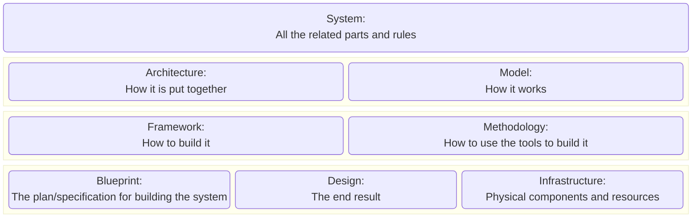


|Concept       |Explanation|
|--------------|-----------|
|Architecture  |A high-level abstraction of the system, that defines structure, function and component and interactions, i.e. how it is put together.|
|Blueprint     |The plan/specification for building the system, i.e. manufacturing/fabricating instructions, e.g. a functional and non-functional specifications based  on the requirements|
|Design        |The process and outcome of having configured a system, i.e. the end result|
|Framework     |A foundtional set of tools, libraries and best practices, i.e. how to build it, as can be shown with e.g. a functional decomposition.|
|Infrastructure|Physical components and resources that constitute the system|
|Methodology   |A set of methods and principles for building a system, i.e. how to use the tools to build the system, such as Agile amd DevOps|
|Model         |A particular implementation of an architecture, describes the working parts of the system, i.e. how it works, as can be illustrated with e.g. a data model|
|Observability |The ability to measure the current holistic state of a system by examining the data collected across multiple layers of the system's architecture.
|Scalability   |The ability of a system to handle an increased workload without loosing performance or compromising availability.
|System        |All the related parts and rules that form the unified solution or enterprise.|

	
**Architectural Definitions and Abbreviations**

*[A list of useful acronyms and abbreviations that are referred to in this this document. Remove superflous ones.]*

Acronym |Description|See also
--------|-----------|--------
AAA     |Authentication, Authorization and Auditing
API     |Application Programming Interface

AVRO    |Binary-encoded JSON-based data format, preferred format for serialising record data for streaming. Also used in Big Data, although uses a row-based storage approach|Parquet,CSV| 
BI      |Business Intelligence
BPM     |Business Process Management
CBOR    |Concise Binary Object Representation, based on JSON
CDC     |Change Data Capture
CDM     |Common Data Model
CI      |Configurable Items, as found ina CMDB
CICD    |Continuous Integration and Continuous Deployment|CMDB|
CMDB    |Configuration Management Database
CORS    |Cross Origin Resource Sharing
COTS    |Commercial Off The Shelf
CQRS    |Command and Query Responsibility Segregation of read and write operations
CSV     |Comma-delimited String Value row-oriented data file format|Parquet, Iceberg|
CRUD    |Create, Retrieve, Update, Delete
CSS     |Cascading Style Sheet
DAD     |Data Architecture Document
DORA    |Digital Operational Resilience Act from the EU to drive digital operational resilliance in financial organizations.
ESB     |Enterprise Service Bus
ETL     |Extract, Transform, Load of batched data
ELT     |Extract,,Load, Transform of streamed data
gRPC    |Cross-platform, high-performance network protocol
GIT     |A better code control and versioning system
GraphQL |Hierarchical Graph Query Language
HLD     |High Level Design
HMAC    |Hash-based Message Authentication Code
HTML    |Hyper Text Mark-up Language
ICD     |Interface Control Document
Iceberg |Data table format for holding huge, slow-changing data, used in data lakes.|Parquet, AVRO
IT      |Information Technology
JSON    |JavaScript Object Notation for schemaless data interchange|YAML
MDM     |Master Data Management
Message Queue|Inter-compontnent asynchronous communication method
MPP     |Massively Parallel Processes
MVP     |Minimum Viable Product
ORC     |A Optimized Row Columnar data file format, used in Big Data|CSV,Iceberg,Parquet,AVRO|
Parquet |A columnar data file format, used in Big Data, especially nested data|CSV,Iceberg,ORC,AVRO|
Pipeline|Data: The route from creation, ingestion, transformation and loading through to consumption
RCS     |Rich Communication Service, successor to SMS
RDP     |Remote Desktop Protocol, for accessing and viewing Windows desktops
ReST    |Representational State Transfer
RPO     |Recovery Point Objective
RTO     |Recovery Time Objective
SAN     |Storage Area Network
SASE    |Secure Access Service Edge, a network architecture that combines VPN and WAN capabilities with cloud-based security.|Zero Trust
SIEM    |Security Information and Event Management 
SQL     |Structured Query Language
SSL     |Secure Sockets Layer
TOGAF   |The Open Group Architecture Framework
UML     |Unified Modelling Language
YAML    |A human-readable (as opposed to JSON) data serialization language|JSON
XML     |Extensible Mark-up Language, a data serialization language
Zero Trust|A Security framework that assumpes that every interface can be a hostile threat|SASE

 


**Table of Content**

*[Add your word processor's TOC link in here - it should look something like this, which was generated in MD using the "Auto Markdown TOC" by Hunter Tran:]*
*[To update these indexes, Right-click on each list and select “Update entire table”.]*

<!-- TOC -->

- [Solution Scope](#solution-scope)
	- [Identification](#identification)
	- [Document Purpose](#document-purpose)
	- [Management summary](#management-summary)
	- [Intended Audience](#intended-audience)
	- [Document Scope](#document-scope)
	- [Enterprise Impact](#enterprise-impact)
- [Capability Map](#capability-map)
- [AS-IS Baseline Architecture](#as-is-baseline-architecture)
	- [AS-IS Contextual architecture](#as-is-contextual-architecture)
	- [AS-IS Conceptual architecture](#as-is-conceptual-architecture)
	- [AS-IS Logical architecture](#as-is-logical-architecture)
		- [Component Definitions](#component-definitions)
		- [Client technology](#client-technology)
		- [Server technology](#server-technology)
		- [Support technology](#support-technology)
	- [AS-IS Application Architecture](#as-is-application-architecture)
	- [AS-IS Technical Environments](#as-is-technical-environments)
		- [AS-IS DEV (Development) environment](#as-is-dev-development-environment)
		- [AS-IS TEST/UAT/QA environment](#as-is-testuatqa-environment)
		- [AS-IS PROD (Production) environment](#as-is-prod-production-environment)
		- [AS-IS Client environment](#as-is-client-environment)
	- [AS-IS Client Environments details](#as-is-client-environments-details)
		- [AS-IS DEV Client Environment](#as-is-dev-client-environment)
		- [AS-IS PROD Client Environment](#as-is-prod-client-environment)
	- [AS-IS Server Environments details](#as-is-server-environments-details)
		- [AS-IS DEV Server Environment](#as-is-dev-server-environment)
		- [AS-IS UAT/TEST/QA Server Environment](#as-is-uattestqa-server-environment)
		- [AS-IS PROD Server Environment](#as-is-prod-server-environment)
	- [AS-IS Storage Architecture](#as-is-storage-architecture)
		- [AS-IS Storage Overview](#as-is-storage-overview)
		- [AS-IS DEV Environment Storage Architecture](#as-is-dev-environment-storage-architecture)
		- [AS-IS UAT Environment Storage Architecture](#as-is-uat-environment-storage-architecture)
		- [AS-IS PROD Environment Storage Architecture](#as-is-prod-environment-storage-architecture)
	- [AS-IS Network Architecture](#as-is-network-architecture)
		- [AS-IS DEV Hardware load balancing](#as-is-dev-hardware-load-balancing)
		- [AS-IS UAT Hardware load balancing](#as-is-uat-hardware-load-balancing)
		- [AS-IS PROD Hardware load balancing](#as-is-prod-hardware-load-balancing)
		- [AS-IS Network Traffic – Client](#as-is-network-traffic--client)
		- [AS-IS Network Traffic – Operational and Support](#as-is-network-traffic--operational-and-support)
		- [AS-IS Network Resilience](#as-is-network-resilience)
		- [AS-IS Client Network Details](#as-is-client-network-details)
		- [Server Network Connection Details](#server-network-connection-details)
			- [Network settings common to all environments](#network-settings-common-to-all-environments)
			- [DEV Environment](#dev-environment)
			- [UAT Environment](#uat-environment)
		- [Client Network Connection Details](#client-network-connection-details)
	- [AS-IS Error Architecture](#as-is-error-architecture)
	- [AS-IS Security Architecture](#as-is-security-architecture)
	- [AS-IS Post-Go-Live Architecture](#as-is-post-go-live-architecture)
- [TO-BE Solution Design](#to-be-solution-design)
	- [TO-BE Contextual Architecture](#to-be-contextual-architecture)
		- [TO-BE Conceptual Architecture](#to-be-conceptual-architecture)
	- [TO-BE Logical Architecture](#to-be-logical-architecture)
- [System Design Pattern](#system-design-pattern)
	- [TO-BE Component Definitions](#to-be-component-definitions)
	- [Client technology](#client-technology-1)
	- [Server technology](#server-technology-1)
	- [Support technology](#support-technology-1)
- [TO-BE Technical Environments](#to-be-technical-environments)
	- [TO-BE DEV Environment](#to-be-dev-environment)
	- [TO-BE UAT Environment](#to-be-uat-environment)
	- [TO-BE PROD Environment](#to-be-prod-environment)
	- [TO-BE Client environment](#to-be-client-environment)
- [TO-BE Client Environments details](#to-be-client-environments-details)
	- [TO-BE DEV Client Environment](#to-be-dev-client-environment)
	- [TO-BE UAT Client Environment](#to-be-uat-client-environment)
	- [TO-BE PROD Client Environment](#to-be-prod-client-environment)
- [TO-BE Server Environments details](#to-be-server-environments-details)
	- [TO-BE DEV Server Environment](#to-be-dev-server-environment)
	- [TO-BE UAT/TEST/QA Server Environment](#to-be-uattestqa-server-environment)
	- [TO-BE PROD Server Environment](#to-be-prod-server-environment)
- [TO-BE Storage Architecture](#to-be-storage-architecture)
	- [TO-BE Storage Overview](#to-be-storage-overview)
	- [TO-BE DEV Environment Storage Architecture](#to-be-dev-environment-storage-architecture)
	- [TO-BE UAT Environment Storage Architecture](#to-be-uat-environment-storage-architecture)
	- [TO-BE PROD Environment Storage Architecture](#to-be-prod-environment-storage-architecture)
- [TO-BE Application Architecture](#to-be-application-architecture)
	- [\[AppName1\] Overview](#appname1-overview)
	- [\[AppName2\] Overview](#appname2-overview)
- [TO-BE Error Architecture](#to-be-error-architecture)
- [TO-BE Network Architecture](#to-be-network-architecture)
	- [Network Architecture Overview](#network-architecture-overview)
	- [Network Traffic](#network-traffic)
		- [Network Traffic – Batch data update](#network-traffic--batch-data-update)
	- [Risk	Network	Route	Impact](#risknetworkrouteimpact)
		- [Network Traffic – Operational and Support](#network-traffic--operational-and-support)
		- [Network Traffic – Part Search and Cross reference](#network-traffic--part-search-and-cross-reference)
	- [Risk	Network	Route	Impact](#risknetworkrouteimpact-1)
		- [Network Traffic – Direct Client](#network-traffic--direct-client)
	- [Risk	Network	Route	Impact](#risknetworkrouteimpact-2)
	- [Network Resilience](#network-resilience)
	- [Server Network Connection Details](#server-network-connection-details-1)
		- [Network settings common to all environments](#network-settings-common-to-all-environments-1)
		- [DEV Environment](#dev-environment-1)
		- [UAT Environment](#uat-environment-1)
		- [PRODUCTION Environment](#production-environment)
	- [Client Network Connection Details](#client-network-connection-details-1)
		- [Configuration of Clients on the Network](#configuration-of-clients-on-the-network)
	- [Network Services](#network-services)
		- [Network File Shares](#network-file-shares)
	- [Network Infrastructure](#network-infrastructure)
	- [Conceptual network infrastructure](#conceptual-network-infrastructure)
	- [Logical network view](#logical-network-view)
	- [1 Switch-configuration context](#1-switch-configuration-context)
- [TO-BE Security Architecture](#to-be-security-architecture)
	- [Security Overview](#security-overview)
	- [Data Security](#data-security)
	- [System Security](#system-security)
	- [Security Approaches](#security-approaches)
		- [Perimeter Security Approach](#perimeter-security-approach)
		- [Traditional zone layers](#traditional-zone-layers)
		- [Zero-Trust Approach](#zero-trust-approach)
		- [Overall System Security Operations](#overall-system-security-operations)
	- [Security Zones](#security-zones)
		- [Client Device Security](#client-device-security)
		- [Secure Client Enclosure](#secure-client-enclosure)
		- [OS build on client devices](#os-build-on-client-devices)
	- [Servers on the network](#servers-on-the-network)
	- [Network Security](#network-security)
	- [Backup and Restore](#backup-and-restore)
	- [System recovery](#system-recovery)
	- [Support Model](#support-model)
	- [Application Codebase](#application-codebase)
	- [Backup and Recovery](#backup-and-recovery)
	- [Disaster Recovery](#disaster-recovery)
	- [Development and Test Environments](#development-and-test-environments)
- [TO-BE Operations and Support Architecture](#to-be-operations-and-support-architecture)
	- [Solution Deployment Choices](#solution-deployment-choices)
		- [Big-Bang Deployment](#big-bang-deployment)
		- [Rolling Deployment](#rolling-deployment)
		- [Blue-Green Deployment](#blue-green-deployment)
		- [Canary Deployment](#canary-deployment)
		- [Feature Toggle](#feature-toggle)
	- [Solution Dependencies](#solution-dependencies)
	- [Operational Requirements](#operational-requirements)
- [Solution Review and Assessment](#solution-review-and-assessment)
	- [Technology Stack Overview](#technology-stack-overview)
	- [Business Requirements Document Mapping](#business-requirements-document-mapping)
	- [Functional Requirements Mapping](#functional-requirements-mapping)
	- [Non-Functional Requirements Mapping](#non-functional-requirements-mapping)
	- [Assessment against Technology Compliance](#assessment-against-technology-compliance)
	- [Community Assessment](#community-assessment)
	- [Assessment against IT principles](#assessment-against-it-principles)
	- [Assessment against Information principles](#assessment-against-information-principles)
		- [Integration Principles](#integration-principles)
		- [Data Principles](#data-principles)
	- [Exceptions from \[Company\]'s Technology \& Data Architecture principles](#exceptions-from-companys-technology--data-architecture-principles)
- [Appendix A: INTERFACES](#appendix-a-interfaces)
	- [Choice of API Architectural Styles](#choice-of-api-architectural-styles)
	- [SOAP (Simple Object Access Prototocol) API style](#soap-simple-object-access-prototocol-api-style)
	- [ReST (Representational State Transfer) API style](#rest-representational-state-transfer-api-style)
	- [GraphQL API style](#graphql-api-style)
	- [gRPC API style](#grpc-api-style)
		- [gRPC-web](#grpc-web)
	- [Websockets API style](#websockets-api-style)
		- [Webhooks API style](#webhooks-api-style)
		- [AJAX (Asynchronous Javascript And XML)](#ajax-asynchronous-javascript-and-xml)
	- [Database Replication Interfaces](#database-replication-interfaces)
	- [API Performance Optimization](#api-performance-optimization)
- [APPENDIX B: ACCESS CONTROL CHOICES](#appendix-b-access-control-choices)
	- [OAUTH2 Access control between \[APP\] and \[3rdPartyApp\] for \[User\]](#oauth2-access-control-between-app-and-3rdpartyapp-for-user)
	- [SSH Keys](#ssh-keys)
	- [SSL Certificates](#ssl-certificates)
	- [Credentials](#credentials)
- [APPENDIX C:ARCHITECTURAL PATTERN USAGE FOR A NON-DISTRIBUTED SYSTEM](#appendix-carchitectural-pattern-usage-for-a-non-distributed-system)
	- [Layered Architecture](#layered-architecture)
	- [Event-driven architecture](#event-driven-architecture)
	- [Microkernel architecture](#microkernel-architecture)
	- [Microservices architecure](#microservices-architecure)
	- [Monolithic architecure](#monolithic-architecure)
- [APPENDIX D: ARCHITECTURAL PATTERN USE FOR A DISTRIBUTED SYSTEMS](#appendix-d-architectural-pattern-use-for-a-distributed-systems)
	- [Ambassador Pattern](#ambassador-pattern)
	- [Circuit-breaker Pattern](#circuit-breaker-pattern)
	- [CQRS Command Query Responsibility Segragation](#cqrs-command-query-responsibility-segragation)
	- [Event Sourcing](#event-sourcing)
	- [Leader Election](#leader-election)
	- [Publisher / Subscriber](#publisher--subscriber)
		- [IBM Message Queue](#ibm-message-queue)
		- [RabbitMQ](#rabbitmq)
		- [Kafka](#kafka)
		- [Pulsar](#pulsar)
	- [Sharding](#sharding)
	- [API-Interfaced Cloud-based solution](#api-interfaced-cloud-based-solution)
- [APPENDIX F: SCALABILLITY CONSIDERATIONS IN THE DESIGN](#appendix-f-scalabillity-considerations-in-the-design)
	- [Anticipated growth](#anticipated-growth)
		- [Completixy estimates with Big O notation](#completixy-estimates-with-big-o-notation)
	- [Design strategies](#design-strategies)
		- [Avoid tight coupling between components](#avoid-tight-coupling-between-components)
		- [Avoid the use of contralized components](#avoid-the-use-of-contralized-components)
		- [Avoid the use of high latency components](#avoid-the-use-of-high-latency-components)
	- [Techniques to scale computing](#techniques-to-scale-computing)
	- [Strategies to scale network usage](#strategies-to-scale-network-usage)
	- [Strategies to scale storage](#strategies-to-scale-storage)
	- [Strategies to scale database](#strategies-to-scale-database)
		- [Indexing](#indexing)
		- [Denormalization](#denormalization)
		- [Caching](#caching)
		- [Replication](#replication)
		- [Sharding](#sharding-1)
		- [Vertical Scaling](#vertical-scaling)
		- [Materilized Views](#materilized-views)
- [APPENDIX G: API GATEWAY CONFIGURATION](#appendix-g-api-gateway-configuration)
	- [Conceptual architecture of an API Gateway](#conceptual-architecture-of-an-api-gateway)
	- [Reasons to have an API Gateway](#reasons-to-have-an-api-gateway)
	- [Options](#options)
<!-- TOC -->

# Solution Scope

## Identification

This [project] is a [functional description].

## Document Purpose 

The purpose of this High Level Design (HLD) is to present the existing AS-IS solution or target estate against the new TO-BE solution, in terms of the application and technology architectures, in order to illustrate how the new solution will fit in the target estate or replace the existing solution and what the impact to peripheral systems already on the estate might be. The information and data architectures are covered in the Data Architecture Document – see Ref. 5. 
It also demonstrates how the solution complies with the prevailing core architectural principles and specifically points out any exception from these principles.

## Management summary

Specifically it provides:

- A bird’s eye view of the system by describing the contextual, conceptual and logical breakdown of the solution. 
- Changes or additions of business processes and workflows that are impacted by the introduction of this solution
- A overview on changes to operational practices and identifies new required skills due to the resulting business changes and the introduction of new technologies that need to be supported or that the system’s users need to be become acquainted with.
- A description of the application and software modules that are at the heart of the solution
- Computational hardware, storage and other related system components (crypto-modules, CUDA processing units, AI processing devices, if used)
- Networking and security , and their respective technical implementations
- Failover prevention and disaster recovery strategies for this solutions

## Intended Audience 

The target audience for this document includes business, technical and non-technical, governance, and project management stakeholders. Specific users of this document include solution architects, data architects, developers and test analysts. This HLD uses technical terms which should be understandable to the indicated audience.
 
## Document Scope 

This HLD specifically presents the application- and technology-related aspects of the system. The scope of the solution is shown in Figure 1. 


## Enterprise Impact

*[Describe what the impact to the peripheral systems would be after the deployment of this solution, e.g. what components will be adversely impacted, or made redundant and removed, or will require users to reskill]*


# Capability Map

A Capability Map of the bunsiness that is undergoing the change creates a business view in a common language that both the technology people and business people in a business can understand.
A Capability Map describes the capabilities required for a business to operate and execute it business vision.
Note: It is no an organizational map. It focuses on what a business does, not how it does it.
This creates a business roadmap, which in turn creates a technology roadmap. From this, one can generate an IT Strategy.


Indicate which areas in the capability maps will be affected by this solution.


# AS-IS Baseline Architecture 

*[There is no need for this AS-IS section if there no existing solution that will be replaced or enhanced by the new solution]*

This chapter describes the AS-IS architecture of the existing solution.

## AS-IS Contextual architecture

*[Simple description of the business-context under which the solution currently operates.]*

Figure: AS-IS Business-contextual architecture

## AS-IS Conceptual architecture

*[Show and explant the current user operation in a workflow diagram. Swim lane diagrams with business area or system in each lane.
This example is rendered using js-sequence-diagrams https://bramp.github.io/js-sequence-diagrams/ ]*


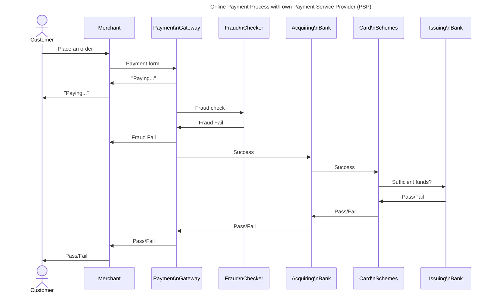

*[Figure: AS-IS Conceptual architecture for Online Payment Process with own Payment Service Provider (PSP)]*


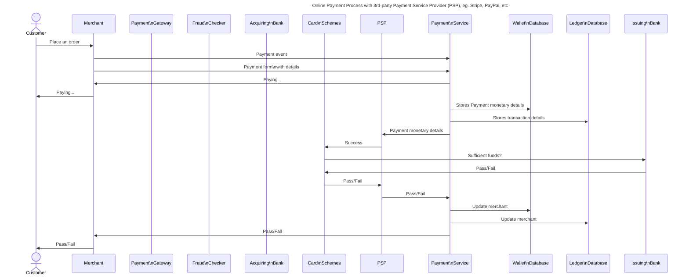


*[Figure: AS-IS Conceptual architecture for Online Payment Process with 3rd-party Payment Service Provider (PSP), eg. Stripe, PayPal]*

## AS-IS Logical architecture

*[Show the application and computational components, network infrastructure, human interface components and storages currently in use in a figure and tables.]*

Figure: AS-IS Logical architecture

### Component Definitions

*[Explanation of the above figure, with brief summary of the technologies involved.]*

Definition	Vendor	Explanation
		
*\1*

### Client technology

*[Explanation with respect to the above figure, e.g. min browser spec, OS]*

### Server technology

*[Explanation with respect to the above figure]*

### Support technology

*[Describe how the AS-IS is supported – does it use VNC, XWindows, RDP, Skype screen share? Who is the current support team? How are software updates performed?]*

## AS-IS Application Architecture

*[Describe the applications and components in detail, and show their interfaces and how the end result of the business requirements are achieved.]*

## AS-IS Technical Environments

*[Describe the technical environments that are used to produce the AS-IS design, or are currently supporting the AS-IS design. If they were torn down after the development or deployment, indicate this.

Example Options:

1.	The DEV and the UAT environments will be reused for the development and test, the existing PRODUCTION environment will be reused on cut-over.
2.	New environments, in which case these need to be specified at the same level of details as the AS-IS.]*

|Environment	|Function        	|Status    |
|-------------|-----------------|----------|
|DEV          |Development	    |Mothballed|
|TEST	        |Testing        	|Mothballed|
|UAT	        |User acceptance	|Mothballed|
|QA	          |Quality Control 	|Mothballed|
|PROD       	|Production	      |Active    |

*Table xx: Summary of AS-IS technical environments*

### AS-IS DEV (Development) environment

*[Describe the development environment and how developers code on it. Any particular DevOps processes that are worth noting?]*


### AS-IS TEST/UAT/QA environment

_[Describe the TEST and UAT environments in terms of servers and storages and network. Any particular DevOps processes that are worth noting, such as the application’s automatic promotion from DEV to TEST to UAT to QA]_

### AS-IS PROD (Production) environment

[Describe the PROD environment in terms of servers and storages and network.]

### AS-IS Client environment

[Describe the technical aspects of the client – usually a device that support a thin-client interface such as a browser]

Item	Specification
Device	[Company]-Standard laptop
Operating system	Windows 7
Inputs	Mouse, keyboard, touchscreen, headset
Outputs	Graphical screen, printer
Programs	Edge Browser Version 9###10##6 (Official build) (64-bit)
*Table xx AS-IS Client specification*


## AS-IS Client Environments details

### AS-IS DEV Client Environment

The design of the DEV client environment includes capacity for hosting the development of other development projects. One development workstation is required per developer.

Device:     |DEV-environment client definition
------------|---------------------------------------------
Utilisation:|Development Workstation, 1 off per developer
Location:   |Development Centre

Device Description	|Specification	|Notes
--------------------|---------------|-----
Replication Required|No	            |
Operating System    |Win11          |	
Patch level	        |Current        |
Patch method        |MS SCCM 20xx   |
CPUs                |xx             |
Memory              |xxGB           |
NICs                |xx             |
VM Machine          |No             |
VM High Availability|N/A            |
VM Anti-Affinity Rule|N/A           |
VM Affinity Rule    |N/A            |

Applications:      |License:
-------------------|---------
Visual Studio 20xx |Enterprise License
DotNet xx	       |Community
Tortoise Subversion|Open-source Plug-In to Visual Studio
SQL Server         |Express	
IIS x.xx	       |Community
 
*Table xx: Physical Architecture: DEV-environment client definition*

### AS-IS PROD Client Environment

The design of the production client environment includes capacity for hosting the application and other standard, peripheral support applications for communications and documentation.


Device:     |PROD-environment client definition
------------|---------------------------------------------
Utilisation:|Development Workstation, 1 off per developer
Location:   |Development Centre

Device Description	|Specification	|Notes
--------------------|---------------|-----
Replication Required|No	            |
Operating System    |Win11          |	
Patch level	        |Current        |
Patch method        |MS SCCM 20xx   |
CPUs                |xx             |
Memory              |xxGB           |
NICs                |xx             |
VM Machine          |No             |
VM High Availability|N/A            |
VM Anti-Affinity Rule|N/A           |
VM Affinity Rule    |N/A            |

Applications:      |License:
-------------------|---------
Visual Studio 20xx |Enterprise License
DotNet xx	       |Community
Tortoise Subversion|Open-source Plug-In to Visual Studio
SQL Server         |Express	
IIS x.xx	       |Community

*Table xx Physical Architecture: PROD-environment client definition*

## AS-IS Server Environments details

### AS-IS DEV Server Environment

Device:     |DEV-environment Database&App Server definition
------------|---------------------------------------------
Utilisation:|Database & Application Server
Location:   |DC1

Device Description	|Specification	|Notes
--------------------|---------------|-----
Replication Required|No	            |
Operating System    |W2K19SP1          |	
Patch level	        |Current        |
Patch method        |MS SCCM 20xx   |
CPUs                |xx             |
Memory              |xxGB           |
NICs                |xx             |
VM Machine          |No             |
VM High Availability|N/A            |
VM Anti-Affinity Rule|N/A           |
VM Affinity Rule    |N/A            |

Applications:      |License:
-------------------|---------
SQL Server 20xx	   |Enterprise License

*Table xx  Database & App server technical details*

Device:     |DEV-environment Web Server definition
------------|---------------------------------------------
Utilisation:|Web Server
Location:   |DC1

Device Description	|Specification	|Notes
--------------------|---------------|-----
Replication Required|No	            |
Operating System    |W2K19SP1       |	
Patch level	        |Current        |
Patch method        |MS SCCM 20xx   |
CPUs                |xx             |
Memory              |xxGB           |
NICs                |xx             |
VM Machine          |No             |
VM High Availability|N/A            |
VM Anti-Affinity Rule|N/A           |
VM Affinity Rule    |N/A            |

Applications:      |License:
-------------------|---------
IIS x.xx           |Enterprise License
DotNet xx	       |Enterprise License

*Table xx  Web server technical details*

### AS-IS UAT/TEST/QA Server Environment

[Follow with the above DEV example]

### AS-IS PROD Server Environment

[Follow with the above DEV example. It is likely that the production environment will have 2 load-balanced web servers]

## AS-IS Storage Architecture

### AS-IS Storage Overview

This section describes the storage infrastructure in the architecture. Table xx shows a solution overview:
Requirement	Design
Storage Capacity	This has not been defined yet and is designed for worst-case - see below.
Performance	This has not been defined yet and is designed for worst-case: a high-performance tier-1 database storage is provided in case the project requires local search capability.
Data Growth	This has not been defined yet and is designed for worst-case
Archiving	There is no archiving in this trial. No requirements defined yet.
Data change rate %	Anticipated 1% daily change
*Table xx Storage Overview*
### AS-IS DEV Environment Storage Architecture

This section describes the storage architecture for the DEV environment.

|Server Node:|	PVUKxxxyyyIIS01 (Web server)|
|------------|------------------------------|

|Local/SAN  |OS/Bin/Data/Page	|FS Type|FS Mapping|Tier|Size(GB)|
|-----------|-------------------|-------|----------|----|--------|
|SAN        |OS NTFS            |NTFS   |C-drive   |   2|      32|
|SAN        |Page               |NTFS   |D-drive   |   2|       8|
|SAN        |Binaries           |NTFS   |E-drive   |   2|      32|
|SAN        |Data               |NTFS   |F-drive   |   2|      32|


*Table xx DEV Web server storage mounts*

|Server Node:|PVUKxxxyyyGIT01 (GIT Version Control server)|
|------------|--------------------------------------------|

|Local/SAN|OS/Bin/Data/Page|FS Type|FS Mapping|Tier|Size(GB)|
|---------|----------------|-------|----------|----|--------|
|SAN|OS|XFS	|/	|2|32|
|SAN|Page|XFS|/swap|2|8|
|SAN|Binaries|XFS|/opt|2|32|
|SAN|Data|XFS|/var|2|128|

*Table xx DEV Version Control server storage mounts*

|Server Node:|PVUKxxxyyySQL01 (Database server)|
|------------|---------------------------------|

|Local/SAN|OS/Bin/Data/Page|FS Type|FS Mapping|Tier|Size(GB)|
|---------|----------------|-------|----------|----|--------|
|SAN|OS|NTFS|C-drive|2|32|
|SAN|Page|NTFS|D-drive|2|8|
|SAN|Binaries|NTFS|E-drive|2|32|
|SAN|Application Data|NTFS|F-drive|2|32|
|SAN|DB Data|NTFS|F-drive|2|128|
|SAN|DB Log|NTFS|G-drive|1|32|
|SAN|DB TempDB|NTFS|H-drive|1|32|
|SAN|DB Backup|NTFS|I-drive|3|128|
|SAN|Fulltext Search|NTFS|J-drive|1|32|

*Table xx DEV Database server storage mounts*

### AS-IS UAT Environment Storage Architecture

This section describes the storage architecture for the UAT environment.

|Server Node:|	PVUKxxxyyyIIS02 (Web server)|
|------------|------------------------------|

|Local/SAN  |OS/Bin/Data/Page	|FS Type|FS Mapping|Tier|Size(GB)|
|-----------|-------------------|-------|----------|----|--------|
|SAN        |OS NTFS            |NTFS   |C-drive   |   2|      32|
|SAN        |Page               |NTFS   |D-drive   |   2|       8|
|SAN        |Binaries           |NTFS   |E-drive   |   2|      32|
|SAN        |Data               |NTFS   |F-drive   |   2|      32|


*Table xx UAT Web server storage mounts*

|Server Node:|PVUKxxxyyySQL02 (Database server)|
|------------|---------------------------------|

|Local/SAN|OS/Bin/Data/Page|FS Type|FS Mapping|Tier|Size(GB)|
|---------|----------------|-------|----------|----|--------|
|SAN|OS|NTFS|C-drive|2|32|
|SAN|Page|NTFS|D-drive|2|8|
|SAN|Binaries|NTFS|E-drive|2|32|
|SAN|Application Data|NTFS|F-drive|2|32|
|SAN|DB Data|NTFS|F-drive|2|128|
|SAN|DB Log|NTFS|G-drive|1|32|
|SAN|DB TempDB|NTFS|H-drive|1|32|
|SAN|DB Backup|NTFS|I-drive|3|128|
|SAN|Fulltext Search|NTFS|J-drive|1|32|

*Table xx UAT Database server storage mounts*

### AS-IS PROD Environment Storage Architecture

This section describes the storage architecture for the PROD (Production) environment.

|Server Node:|	PVUKxxxyyyIIS03 (Web server)|
|------------|------------------------------|

|Local/SAN  |OS/Bin/Data/Page	|FS Type|FS Mapping|Tier|Size(GB)|
|-----------|-------------------|-------|----------|----|--------|
|SAN        |OS NTFS            |NTFS   |C-drive   |   2|      32|
|SAN        |Page               |NTFS   |D-drive   |   2|       8|
|SAN        |Binaries           |NTFS   |E-drive   |   2|      32|
|SAN        |Data               |NTFS   |F-drive   |   2|      32|

*Table xx PROD Web server 1 storage mounts*

|Server Node:|	PVUKxxxyyyIIS04 (Web server)|
|------------|------------------------------|

|Local/SAN  |OS/Bin/Data/Page	|FS Type|FS Mapping|Tier|Size(GB)|
|-----------|-------------------|-------|----------|----|--------|
|SAN        |OS NTFS            |NTFS   |C-drive   |   2|      32|
|SAN        |Page               |NTFS   |D-drive   |   2|       8|
|SAN        |Binaries           |NTFS   |E-drive   |   2|      32|
|SAN        |Data               |NTFS   |F-drive   |   2|      32|

*Table xx PROD Web server 2 storage mounts*

|Server Node:|PVUKxxxyyySQL03 (Database server)|
|------------|---------------------------------|

|Local/SAN|OS/Bin/Data/Page|FS Type|FS Mapping|Tier|Size(GB)|
|---------|----------------|-------|----------|----|--------|
|SAN|OS|NTFS|C-drive|2|32|
|SAN|Page|NTFS|D-drive|2|8|
|SAN|Binaries|NTFS|E-drive|2|32|
|SAN|Application Data|NTFS|F-drive|2|32|
|SAN|DB Data|NTFS|F-drive|2|128|
|SAN|DB Log|NTFS|G-drive|1|32|
|SAN|DB TempDB|NTFS|H-drive|1|32|
|SAN|DB Backup|NTFS|I-drive|3|128|
|SAN|Fulltext Search|NTFS|J-drive|1|32|

*Table xx PROD Database server storage mounts*


## AS-IS Network Architecture

[Show the AS-IS devices, how they are connected to the various networks in data centres, locations and clouds, and the information flow of the most pertinent types of transactions. 
Indicate what normal network traffic in production use is, and what support traffic is. 
Also indicate VNets and the network resilience design.]

### AS-IS DEV Hardware load balancing

There is no hardware load balancing in this environment.

### AS-IS UAT Hardware load balancing

There is no hardware load balancing in this environment.

### AS-IS PROD Hardware load balancing

There is hardware load balancing between the two web servers in this environment.

This is achieved on with an F5 network load balancer – see details in Network Architecture chapter.


|Node           |HLB Node|Port|Monitor Method|Server down landing page|
|---------------|--------|----|--------------|------------------------|
|PVUKxxxyyyIIS05|PVUKxxxyyyIIS03|80|Ping & HTTP|Get every 5 seconds, timeout 16 seconds|TBA|
|               |PVUKxxxyyyIIS04|80|Ping & HTTP Get every 5 seconds, timeout 16 seconds|TBA|

*Table xx PROD Hardware Load Balancing*

### AS-IS Network Traffic – Client

Figure x: Client network traffic steps between network components

Step|Description|Type|Impact
----|-----------|----|------
1   |Cloud applications|HTTPS|Minimal
2   |Database|TCP/IP|Minimal

*Table xx: Client network traffic Steps*

### AS-IS Network Traffic – Operational and Support

Figure  x: Operational and Support network traffic Steps

Step|Description|Type|Impact
----|-----------|----|------
    |           |    |

*Table xx: Operational and Support network traffic Steps*

### AS-IS Network Resilience

There is no network resilience.

### AS-IS Client Network Details

Figure: Test environment connected to the UAT server environment

DEV Environment

|Client Id|Use Case|IP|
|---------|--------|--|
|#|[test case set 1]|[aaa.bbb.ccc.ddd]|
|#|[test case set 2]|[aaa.bbb.ccc.eee]|
|#|[test case set 3]|[aaa.bbb.ccc.fff]|
|#|[test case set 4]|[aaa.bbb.ccc.ggg]|

*Table xx Test Client IP Configurations, specific details*

|Network Setting|Value  |
|---------------|-------|
|Gateway	    |x.x.x.x|
|Mask	        |x.x.x.x|
|DNS1	        |x.x.x.x|
|DNS2	        |x.x.x.x|

*Table xx Test Client IP Configuration – common details*


### Server Network Connection Details

#### Network settings common to all environments

|Network Device|Description|IP Address|
|--------------|-----------|----------|
|DNS	||17#####03|
|DNS	||17#####03|
|Citrix Terminal Server||17######7|
|Gateway Server|See Table xx for details||

*Table xx  Server IP Configurations - Common*

#### DEV Environment

|Server Type|DNS Name|IP|
|-----------|--------|--|
|DB	|PVUKDEVKSKDB01.[DOMAIN].[Company].ORG	|17####8##1/28|
|APP|PVUKDEVKSKAPP01.[DOMAIN].[Company].ORG	|17####8##2/28|
|WEB|PVUKDEVKSKIIS01.[DOMAIN].[Company].ORG	|17####8##3/27|


*Table xx Server IP Configuration – DEV Server-specific*

|Server Type|IP|Mask|GW|VLAN|
|-----------|--|----|--|----|
|DB         |17####7##80|25##5##5##/40|17####7##77|343|
|APP        |17####7##64|25##5##5##/40|17####7##61|342|
|WEB        |17####7##37|25##5##5##/24|17####7##34|341|

*Table xx DEV Server Gateways and VLAN*

#### UAT Environment

|Server Type|DNS Name|IP|
|-----------|--------|--|
|DB	|PVUKUATKSKDB01.[DOMAIN].[Company].ORG	|17####8##1/28|
|APP|PVUKUATKSKAPP01.[DOMAIN].[Company].ORG	|17####8##2/28|
|WEB|PVUKUATKSKIIS01.[DOMAIN].[Company].ORG	|17####8##3/27|

*Table xx Server IP Configuration – UAT Server-specific*

|Server Type|IP|Mask|GW|VLAN|
|-----------|--|----|--|----|
|DB         |17####7##80|25##5##5##/40|17####7##77|344|
|APP        |17####7##64|25##5##5##/40|17####7##61|345|
|WEB        |17####7##37|25##5##5##/24|17####7##34|346|

*Table xx UAT Server Gateways and VLAN*

###.4	PRODUCTION Environment

|Server Type|DNS Name|IP|
|-----------|--------|--|
|DB	|PVUKDEVKSKDB01.[DOMAIN].[Company].ORG	|17####8##1/28|
|APP|PVUKDEVKSKAPP01.[DOMAIN].[Company].ORG	|17####8##2/28|
|WEB|PVUKDEVKSKIIS01.[DOMAIN].[Company].ORG	|17####8##3/27|

*Table xx Server IP Configuration – PROD Server-specific*

|Server Type|IP|Mask|GW|VLAN|
|-----------|--|----|--|----|
|DB         |17####7##80|25##5##5##/40|17####7##77|347|
|APP        |17####7##64|25##5##5##/40|17####7##61|348|
|WEB        |17####7##37|25##5##5##/24|17####7##34|349|

*Table xx PROD Server Gateways and VLAN*

### Client Network Connection Details

###.1	Configuration of Clients on the Network 

|Client location|Name|Client Type|IP Address|Format|Patch Info|
|---------------|----|-----------|----------|------|----------|
|               |    |           |          |      |          |
|               |    |           |          |      |          |
|               |    |           |          |      |          |

*Table xx: Client IP Configuration - Specific settings*

|Network Setting |Value  |
|----------------|-------|
Gateway	|x.x.x.x
Mask	|x.x.x.x
DNS1	|x.x.x.x
DNS2	|x.x.x.x
VLAN	|410
Proxy	|sip-sysapp.ukdmz
Proxy Port|8080
Proxy user|[PROJECT]-allocated ID
Proxy password|[PROJECT]-generated

*Table xx Client IP Configuration – Common settings*

|Network Setting|Value|
|---------------|-----|
|DNS1 Helper IP	|17#####0|
|DNS2 Helper IP	|17#####1|
|VLAN	        |410|

*Table xx  Remote Site Router Configuration*

## AS-IS Error Architecture

[Describe error handling, logging, notifications, error severities, integration with the estate’s operational monitoring system]

## AS-IS Security Architecture

[Describe pertinent security features, such as encryption on the move and at rest, authentication mechanisms, access-controlled roles and allowed operations.]

## AS-IS Post-Go-Live Architecture

[Describe the support system in place for this solution, contact details to first line support of the respective vendors involved]
 
# TO-BE Solution Design
This section describes the TO-BE architecture of the future solution that will be applied.
## TO-BE Contextual Architecture
[Simple description of the business-context under which the solution currently operates. Clearly indicate the changes if any between the AS-IS and the TO-BE versions.]

Figure: TO-BE Contextual architecture
### TO-BE Conceptual Architecture

[Show and explain the current user operation in a workflow diagram. Swim lane diagrams with business area or system in each lane. Clearly indicate the changes if any between the AS-IS and the TO-BE versions.]


Figure: TO-BE Conceptual use case for ...

## TO-BE Logical Architecture

*[Show the application and computational components, human interface components and storages currently in use. Show in a figure. Indicate the changes if any between the AS-IS and the TO-BE versions]*

Figure: Logical architecture of the client solution

# System Design Pattern

The following general reusable solutions approaches were used

*[Explain the use of the (new|inherited) distributed system design pattern, if any, and how the chosen patterns measures up in terms of software engineering effort, computer capabilities, system availability and business risk amelioration.]*

* Classic Patterns
- Layered: Presentation, APplication, Business and Data. Good for simple implementations
- Pipe-filter: 
- Client-Server: 
- Model/View/Controller: Data, presentation and user interaction
- Event bus: Publisher / Subscriber approach
- Microserices: API interfaces to services
- Broker: Coordinates communication between components
- Blackboard: 
- Master/Slave: Work distribution to slaves, master collects the result. Only for certain problems that can be suitable decomposed, e.g. mathematics or database replications.

* Distributed Systems
- Peer to peer: Peer is both client and server. No guarantee of performance, poor security, but highly robust.


* Distributed Systems
- Ambassador 
- Circuit Breaker
- CQRS - Command Query Responsibility Segregation
- Event Sourcing 
- Leader Election
- Publisher / Subscriber
- Sharding
- Strangler Fig Tree - gradually replacing components 


## TO-BE Component Definitions

 [Explanation of the above figure, with brief summary of the technologies involved. Indicate the new or changed components.]

Definition	Vendor	Explanation
		
		
		
*Table xx Component definitions and explanations*

## Client technology

[Explanation with respect to the above figure, e.g. min browser spec, OS, if different to the AS-IS ]

## Server technology

[Explanation with respect to the above figure, if different to the AS-IS]


## Support technology

[Describe how the TO-BE is supported if different to the AS-IS]

 
# TO-BE Technical Environments

 [Describe the technical environments that will be deployed, if they are different to the AS-IS. If they will be torn down after the development or deployment, indicate this. Example: 3 environments. Normally QA, TEST and UAT are separate environments]

[Describe the technical environments that are used to produce the AS-IS design, or are currently supporting the AS-IS design. If they were torn down after the development or deployment, indicate this.
Example Options:
1.	The DEV, UAT environments will be reused for the development and test, The existing PRODUCTION environment will be reused on cut-over.
2.	New environments, in which case these need to be specified at the same level of details as the AS-IS.]

Environment	Function	Status
DEV	Development	Active
UAT/TEST/QA	Test,QA,User Acceptance	Active
PROD	Production	Active
*Table xx Summary of TO-BE technical environments*

## TO-BE DEV Environment

## TO-BE UAT Environment

## TO-BE PROD Environment


## TO-BE Client environment

[Describe the technical aspects of the client – usually a device that support a thin-client interface such as a browser]

Item	Specification
Device	[Company]-Standard laptop
Operating system	Windows 7
Inputs	Mouse, keyboard, touchscreen, headset
Outputs	Graphical screen, printer
Programs	Edge Browser Version 9###10##6 (Official build) (64-bit)
*Table xx AS-IS Client specification*


# TO-BE Client Environments details

## TO-BE DEV Client Environment

The design of the DEV client environment includes capacity for hosting the development of other development projects. One development workstation is required per developer.

Utilisation:	Development Workstation, 1 off per developer
Location:	Development Centre
Device Description	Specification	Notes
Replication Required	No	
Operating System	Win11	
Patch level	Current	
Patch method	MS SCCM 20xx	
CPUs	xx	
Memory	xxGB	
NICs	xx	
VM Machine	No	
VM High Availability	N/A	
VM Anti-Affinity Rule	N/A	
VM Affinity Rule	N/A	
Applications:	Visual Studio 20xx	Enterprise License
	DotNet xx	
	GIT client	Open-source Plug-In to Visual Studio
	SQL Server Express	
	IIS x.xx	
*Table xx Physical Architecture: DEV-environment client definition*

## TO-BE UAT Client Environment

The design of the UAT client environment includes capacity for hosting the application and other standard, peripheral support applications for communications and documentation.
UAT testing will be conducted in a secure test environment by testers. Testing will commence following user training and completion of the relevant test plans.

Utilisation:	Standard issue laptop, 1 off per user
Location:	Secure Testing Centre
Device Description	Specification	Notes
Replication Required	No	
Operating System	Win11	
Patch level	Current	
Patch method	MS SCCM 20xx	
CPUs	xx	
Memory	xxGB	
NICs	xx	
VM Machine	No	
VM High Availability	N/A	
VM Anti-Affinity Rule	N/A	
VM Affinity Rule	N/A	
Applications:	Standard apps	Enterprise License
	GIT client	Open-source Plug-In to Visual Studio
	Test Console	Test management application
	Test system	System under test with apps and libs
*Table xx Physical Architecture: UAT-environment client definition*


## TO-BE PROD Client Environment

The design of the production client environment includes capacity for hosting the application and other standard, peripheral support applications for communications and documentation.

Utilisation:	Standard issue laptop, 1 off per user
Location:	Secure Operations Centre
Device Description	Specification	Notes
Replication Required	No	
Operating System	Win11	
Patch level	Current	
Patch method	MS SCCM 20xx	
CPUs	xx	
Memory	xxGB	
NICs	xx	
VM Machine	No	
VM High Availability	N/A	
VM Anti-Affinity Rule	N/A	
VM Affinity Rule	N/A	
Applications:	Standard apps	Enterprise License
	Test system	System under test with apps and libs
*Table xx Physical Architecture: PROD-environment client definition*

# TO-BE Server Environments details

## TO-BE DEV Server Environment

This section lists the servers in the DEV environment. The GIT code repository service is a shared service between other projects.

|Server Criteria|Value|
|------------|---------------|
|Utilisation:|Database Server|
|Location:|Development Centre|
|Device Description|Specification	Notes|
|Replication Required|No	|
|Operating System|W2K19SP1	|
|Patch level|Current	|
|Patch method|MS SCCM 20xx	|
|CPUs	|xx	|
|Memory	|xxGB	|
|NICs	|xx	|
|VM Machine|	Yes	|
|VM High Availability|No	|
|VM Anti-Affinity Rule|No	|
|VM Affinity Rule|No	|
|Applications:| SQL Server 20xx	Enterprise License|

*Table xx  Database server technical details*

|Server Criteria|Value|
|------------|---------------|
|Utilisation:	|Web server |
|Location:	|Development Centre|
|Device Description	Specification	|Notes|
|Replication Required	|No	|
|Operating System	|W2K19SP1|	
|Patch level	|Current	|
|Patch method	|MS SCCM 20xx	|
|CPUs	|xx	|
|Memory	|xxGB|	
|NICs	|xx	|
|VM Machine	|Yes	|
|VM High Availability	|No	|
|VM Anti-Affinity Rule	|No	|
|VM Affinity Rule	|No	|
|Applications:|	IIS x.xx Enterprise License, DotNet xx	|

*Table xx  Web server technical details*


|Server Criteria|Value|
|------------|---------------|
|Utilisation:	|Version Control Server|
|Location:	|Development Centre|
|Device Description	Specification|	Notes|
|Replication Required	|No	|
|Operating System	|RedHat 9.x| 
|Patch level	|Current	|
|Patch method	|Red Hat YUM	|
|CPUs	|xx	|
|Memory	|xxGB	|
|NICs	|xx	|
|VM Machine	|No	|
|VM High Availability	|N/A	|
|VM Anti-Affinity Rule	|N/A	|
|VM Affinity Rule	|N/A	|
|Applications:	|GIT	Open source License, Apache Server	|

*Table xx  GIT Version Control server technical details*


## TO-BE UAT/TEST/QA Server Environment

*[Follow the above DEV example]*

## TO-BE PROD Server Environment

*[Follow the above DEV example. It is likely that the production environment will have 2 load-balanced web servers]*


# TO-BE Storage Architecture

## TO-BE Storage Overview

This section describes the storage infrastructure in the architecture. Table xx shows a solution overview:
Requirement	Design
Storage Capacity	This has not been defined yet and is designed for worst-case - see below.
Performance	This has not been defined yet and is designed for worst-case: a high-performance tier-1 database storage is provided in case the project requires local search capability.
Data Growth	This has not been defined yet and is designed for worst-case
Archiving	There is no archiving in this trial. No requirements defined yet.
Data change rate %	Anticipated 1% daily change
*Table xx Storage Overview*

## TO-BE DEV Environment Storage Architecture

This section describes the storage architecture for the DEV environment.
Server Node:	PVUKxxxyyyIIS01 (Web server)
Local/SAN	OS/Bin/Data/Page	FS	Mapping	Tier	Size(GB)
SAN	OS	NTFS	C-drive	2	32
SAN	Page	NTFS	D-drive	2	8
SAN	Binaries	NTFS	E-drive	2	32
SAN	Data	NTFS	F-drive	2	32
*Table xx DEV Web server storage mounts*

Server Node:	PVUKxxxyyyGIT01 (GIT Version Control server)
Local/SAN	OS/Bin/Data/Page	FS	Mapping	Tier	Size(GB)
SAN	OS	XFS	/	2	32
SAN	Page	XFS	/swap	2	8
SAN	Binaries	XFS	/opt	2	32
SAN	Data	XFS	/var	2	128
*Table xx DEV Version Control server storage mounts*

Server Node:	PVUKxxxyyySQL01 (Database server)
Local/SAN	OS/Bin/Data/Page	FS	Mapping	Tier	Size(GB)
SAN	OS	NTFS	C-drive	2	32
SAN	Page	NTFS	D-drive	2	8
SAN	Binaries	NTFS	E-drive	2	32
SAN	Application Data	NTFS	F-drive	2	32
SAN	DB Data	NTFS	F-drive	2	128
SAN	DB Log	NTFS	G-drive	1	32
SAN	DB TempDB	NTFS	H-drive	1	32
SAN	DB Backup	NTFS	I-drive	3	128
SAN	Fulltext Search	NTFS	J-drive	1	32
*Table xx DEV Database server storage mounts*

## TO-BE UAT Environment Storage Architecture

This section describes the storage architecture for the UAT environment.
Server Node:	PVUKxxxyyyIIS02 (Web server)
Local/SAN	OS/Bin/Data/Page	FS	Mapping	Tier	Size(GB)
SAN	OS	NTFS	C-drive	2	32
SAN	Page	NTFS	D-drive	2	8
SAN	Binaries	NTFS	E-drive	2	32
SAN	Data	NTFS	F-drive	2	32
*Table xx UAT Web server storage mounts*

Server Node:	PVUKxxxyyySQL02 (Database server)
Local/SAN	OS/Bin/Data/Page	FS	Mapping	Tier	Size(GB)
SAN	OS	NTFS	C-drive	2	32
SAN	Page	NTFS	D-drive	2	8
SAN	Binaries	NTFS	E-drive	2	32
SAN	Application Data	NTFS	F-drive	2	32
SAN	DB Data	NTFS	F-drive	2	128
SAN	DB Log	NTFS	G-drive	1	32
SAN	DB TempDB	NTFS	H-drive	1	32
SAN	DB Backup	NTFS	I-drive	3	128
SAN	Fulltext Search	NTFS	J-drive	1	32
*Table xx UAT Database server storage mounts*

## TO-BE PROD Environment Storage Architecture

This section describes the storage architecture for the PROD (Production) environment.

Server Node:	PVUKxxxyyyIIS03 (Web server)
Local/SAN	OS/Bin/Data/Page	FS	Mapping	Tier	Size(GB)
SAN	OS	NTFS	C-drive	2	32
SAN	Page	NTFS	D-drive	2	8
SAN	Binaries	NTFS	E-drive	2	32
SAN	Data	NTFS	F-drive	2	32
*Table xx PROD Web server 1 storage mounts*

Server Node:	PVUKxxxyyyIIS04 (Web server)
Local/SAN	OS/Bin/Data/Page	FS	Mapping	Tier	Size(GB)
SAN	OS	NTFS	C-drive	2	32
SAN	Page	NTFS	D-drive	2	8
SAN	Binaries	NTFS	E-drive	2	32
SAN	Data	NTFS	F-drive	2	32
*Table xx PROD Web server 2 storage mounts*

Server Node:	PVUKxxxyyySQL03 (Database server)
Local/SAN	OS/Bin/Data/Page	FS	Mapping	Tier	Size(GB)
SAN	OS	NTFS	C-drive	2	32
SAN	Page	NTFS	D-drive	2	8
SAN	Binaries	NTFS	E-drive	2	32
SAN	Application Data	NTFS	F-drive	2	32
SAN	DB Data	NTFS	F-drive	2	128
SAN	DB Log	NTFS	G-drive	1	32
SAN	DB TempDB	NTFS	H-drive	1	32
SAN	DB Backup	NTFS	I-drive	3	128
SAN	Fulltext Search	NTFS	J-drive	1	32
*Table xx PROD Database server storage mounts*

 
# TO-BE Application Architecture

[Describe the applications that makeup the solution and their respective components in detail, and show their interfaces and how the end result of the business requirements are achieved.]

## [AppName1] Overview

 
Figure 2 [Example application and its components]

[Example: Figure 2 is a Vendor-supplied representation of the logical architecture of the client-side application and applies to the product. The data flow on the client application is detailed in Figure xx - also a Vendor-supplied representation.]
Component	Description	Presentation layer	Business layer	Integration layer	System support layer
Device Executive					
Supervisor					
Monitor					
Downloader					
Event Logger					X

*Table xx  Application Components for client*

## [AppName2] Overview

[Rinse and repeat for every application in the solution]

# TO-BE Error Architecture
[Describe error handling, logging, notifications, error severities, integration with the estate’s operational monitoring system]
 
# TO-BE Network Architecture

[Show the TO-BE devices, how they are connected to the various networks in data centres, locations and clouds, and the information flow of the most pertinent types of transactions. 
Indicate what is normal network traffic in production use, and what is support traffic. 
Also indicate VNets and the network resilience design.]

## Network Architecture Overview

Network Design	Required	Reason
Load Balancing	Yes	Required for webservers, although not currently used.
SSL Offloading	No	No encrypted traffic
Network Security	Yes	New client devices served by data-centre servers
Network Performance	No	Not anticipated
Network Resilience	Yes	Datacentre internal network resilience. Part of [Company] System standard pattern.
Non group-compliant IP Addressing	No	Use group-compliant IP addressing scheme for client devices and data centre devices
*Table xx Network Architecture Overview*

## Network Traffic

### Network Traffic – Batch data update

[Example if batches are run:]
Figure xx shows the network traffic for daily data updates from the [Company] System data back-end to the client solution. This batch is scheduled to run daily at 06:00. Data take-on to all the client devices is completed by 07:00. The total data load per client device is in the region of 200K. This data is eventually distributed to each client.


Figure: Network flows for batch jobs

Flow	Route	Purpose	Type	Frequency	Volume
Data centre	AbInitio server	Initiates data extraction process	Daily	5MB
Data centre	Reference data update	ETL process	Daily	5MB
*Table xx Network traffic flows - Batch data update*
No potential network bottlenecks are anticipated.
 Risk	Network	Route	Impact
-		
-

*Table xx Potential bottlenecks - Batch data update*

### Network Traffic – Operational and Support

Operational and support traffic is anticipated to exist during standard operating hours in the standard location

*Figure xx shows the network traffic.*

*Figure: Network flows for batch jobs*

|Flow   |Route  |Purpose    |Type   |Network    |Frequency  |Volume|
|-------|-------|-----------|-------|-----------|-----------|------|
||||||||

*Table xx Network traffic flows - Batch data update*

No potential network bottlenecks are anticipated.

|Risk	|Network	|Route	|Impact|
|-------|-----------|-------|------|
|||||

*Table xx Potential bottlenecks - Operational support*

### Network Traffic – Part Search and Cross reference

*Figure xx shows the network traffic.*

*Figure: Network flows for batch jobs*


|Flow   |Route  |Purpose    |Type   |Network    |Frequency  |Volume|
|-------|-------|-----------|-------|-----------|-----------|------|
||||||||

*Table xx Network traffic flows – Part Search and cross reference*

No potential network bottlenecks are anticipated.
Risk	Network	Route	Impact
-		
-		
*Table xx Potential bottlenecks - Part Search and cross reference*

### Network Traffic – Direct Client

Figure xx shows the client network traffic.

Figure: Network flows for client network traffic.

|Flow   |Route  |Purpose    |Type   |Network    |Frequency  |Volume|
|-------|-------|-----------|-------|-----------|-----------|------|
||||||||

*Table xx: Network traffic flows – client network traffic.*

No potential network bottlenecks are anticipated.
Risk	Network	Route	Impact
-		
-

*Table xx Potential bottlenecks - Client network traffic.*

## Network Resilience

[Example if the solution has network resilience]
The servers on all the environments are fully resilient. This is conceptually explained below in Figure xx.

Figure: Conceptual network resilience by interconnecting switches, firewalls and load balancers

## Server Network Connection Details

### Network settings common to all environments

|Network Device|Description|IP Address|
|--------------|-----------|----------|
|DNS	||17#####03|
|DNS	||17#####03|
|Citrix Terminal Server||17######7|
|Gateway Server|See Table xx for details||

*Table xx  Server IP Configurations - Common*

### DEV Environment


|Server Type|DNS Name|IP|
|-----------|--------|--|
|DB	|PVUKDEVKSKDB01.[DOMAIN].[Company].ORG	|New|
|APP|PVUKDEVKSKAPP01.[DOMAIN].[Company].ORG	|New|
|WEB|PVUKDEVKSKIIS01.[DOMAIN].[Company].ORG	|New|

*Table xx Server IP Configuration – DEV Server-specific*

|Server Type|IP|Mask|GW|VLAN|
|-----------|--|----|--|----|
|DB         |17####7##80|25##5##5##/40|17####7##77|343|
|APP        |17####7##64|25##5##5##/40|17####7##61|342|
|WEB        |17####7##37|25##5##5##/24|17####7##34|341|

*Table xx DEV Server Gateways and VLAN*

### UAT Environment

|Server Type|DNS Name|IP|
|-----------|--------|--|
|DB	|PVUKUATKSKDB01.[DOMAIN].[Company].ORG	|New|
|APP|PVUKUATKSKAPP01.[DOMAIN].[Company].ORG	|New|
|WEB|PVUKUATKSKIIS01.[DOMAIN].[Company].ORG	|New|

*Table xx Server IP Configuration – UAT Server-specific*

|Server Type|IP|Mask|GW|VLAN|
|-----------|--|----|--|----|
|DB         |17####7##80|25##5##5##/40|17####7##77|343|
|APP        |17####7##64|25##5##5##/40|17####7##61|342|
|WEB        |17####7##37|25##5##5##/24|17####7##34|341|


*Table xx UAT Server Gateways and VLAN*

### PRODUCTION Environment

|Server Type|DNS Name|IP|
|-----------|--------|--|
|DB	|PVUKPRDKSKDB01.[DOMAIN].[Company].ORG	|New|
|APP|PVUKPRDKSKAPP01.[DOMAIN].[Company].ORG	|New|
|WEB|PVUKPRDKSKIIS01.[DOMAIN].[Company].ORG	|New|

*Table xx Server IP Configuration – PROD Server-specific*


|Server Type|IP|Mask|GW|VLAN|
|-----------|--|----|--|----|
|DB         |17####7##80|25##5##5##/40|17####7##77|343|
|APP        |17####7##64|25##5##5##/40|17####7##61|342|
|WEB        |17####7##37|25##5##5##/24|17####7##34|341|


*Table xx PROD Server Gateways and VLAN*

## Client Network Connection Details

### Configuration of Clients on the Network 

|Client location|Name|Client Type|IP Address|Format|Patch Info|
|---------------|----|-----------|----------|------|----------|
|               |    |           |          |      |          |
|               |    |           |          |      |          |
|               |    |           |          |      |          |

*Table xx Client IP Configuration - Specific settings*

|Network Setting|Value|
|---------------|-----|
Gateway	|x.x.x.x
Mask	|x.x.x.x
DNS1	|x.x.x.x
DNS2	|x.x.x.x
VLAN	|410
Proxy	|sip-sysapp.ukdmz
Proxy Port|8080
Proxy user|[PROJECT]-allocated ID
Proxy password|[PROJECT]-generated

*Table xx Client IP Configuration – Common settings*

|Network Setting|Value|
|---------------|-----|
|DNS1 Helper IP	|17#####0|
|DNS2 Helper IP	|17#####1|
|VLAN	        |410|

*Table xx  Remote Site Router Configuration*

## Network Services

### Network File Shares

[Example given below:]

**DEV Environment**

|Share|Shared from|Access|
|-----|-----------|------|
|\PVUKDEVSKAPP01.[DOMAIN].[Company].ORG\[project]\in |F:\Data[project]\in |Everyone|
|\PVUKDEVSKAPP01.[DOMAIN].[Company].ORG\[project]\out|F:\Data[project]\out|Everyone|

*Table xx Network File shares on DEV environment*

**UAT Environment**

|Share|Shared from|Access|
|-----|-----------|------|
|\PVUKTSTKSKAPP01.[DOMAIN].[Company].ORG\[project]\in |F:\Data[project]\in |Everyone|
|\PVUKTSTKSKAPP01.[DOMAIN].[Company].ORG\[project]\out|F:\Data[project]\out|Everyone|

*Table xx Network File shares on UAT environment*

**PRODUCTION Environment**

|Share|Shared from|Access|
|-----|-----------|------|
|\PVUKPRDKSKAPP01.[DOMAIN].[Company].ORG\[project]\in |F:\Data[project]\in	|Everyone|
|\PVUKPRDKSKAPP01.[DOMAIN].[Company].ORG\[project]\out|F:\Data[project]\out|Everyone|

*Table xx Network File shares on PROD environment*

Network services that are consumed by the servers and the client devices, as detailed below:

|Service|Reason|Details|
|-------|------|-------|
|DNS|Resilience and flexibility and future DR|[TBA], [TBA]|
|DHCP|||
|WINS|||
|NTP|Clock sync.|TBA|
|AD	|IAM|Domain: XXXX|
|SMTP|SSRS report notification|TBA. Source email: noreply@[Company] System.com

*Table xx Server-side Network Services*

|Service|Reason|Details|
|-------|------|-------|
|DNS	|Resilience and flexibility and future DR|[TBA], [TBA]|
|DHCP|||
|WINS|||
|NTP|Clock sync.|TBA|
|AD	|IAM|Domain: XXXX|
|SMTP|	|	|

*Table xx Client Network Services*

## Network Infrastructure

This section details the resulting network infrastructure
## Conceptual network infrastructure

[Show where the solution is located on the various VLANs and  VNETs]
## Logical network view

[Heavy-duty network implementations views if the project requires this.]
##0	Physical network view
[Heavy-duty network implementations views if the project requires this.]

## 1 Switch-configuration context
[Heavy-duty network implementations views if the project requires this.]
 
# TO-BE Security Architecture

[Describe pertinent security features, such as encryption on the move and at rest, authentication mechanisms, access-controlled roles and allowed operations, requirements for firewall, security zones, and interfaces across these zones.]

## Security Overview

[This section explains how security and compliance is implemented for the solution.]

Requirement|Implementation
-----------|--------------
Data Sensitivity Classification|Anonymous and not commercially sensitive
Business impact if information is disclosed|Negligible
Business impact if data is changed by adversary?|Significant
Implementation Approach?|Third-party application
Security operations|Sophos AV on each client and server
Logging of security events & data|Windows Event Logger, stored indeterminately

*Table xx: Data Compliance*

Requirement|Implementation
-----------|--------------
Electrical compliance|Yes
Desktop Support Compliance|Yes
Waste compliance|No
Data Protection Act|No
PCI DSS|No
Distance Selling Act|No
Disability Discrimination|No

*Table xx: Legal Compliance*

Requirement|Implementation
-----------|--------------
How will users authenticate to the system?|There is no user authentication on client devices. All users are treated as anonymous.
Is Active Directory to be used for authentication|No, as there is no user authentication.
How will users gain authorisation to the system and data?|Users are not required to view system data.
Are passwords transferred over the network in clear text?|No, as there is no user authentication.
Highlight any part of the system not based on the least privilege model?|None.

*Table xx: Authentication, Authorisation and Access Control*

## Data Security

*[Describe how the following aspects were incorporated into the design:]

- Data is encrypted at rest
- Data is encrypted in transit
- Access control to data
- Data held to ransom mitigation
- Password implementation
- Data integrity monitoring

## System Security

*[Describe how the following aspects were incorporated into the design:]

- How software vulnerabilities are mitigated
- Operating system integrity monitoring


## Security Approaches

*[Describe how the following aspects were incorporated into the design:]

### Perimeter Security Approach

### Traditional zone layers


### Zero-Trust Approach
Treat every component, service and user as continuosly-exposed to hostile security threats.
- Never trust, always verify
- Implement the least privilege
- "Assume breach". How is the system design to aid quick recovery from break, and to minimize the attack surface?


### Overall System Security Operations

*[How are the following operations ]*

Protect: Careful public information, social media, server error messages, disable unused ports & services, use honeypot decoys, use firewalls, user awareness, DKIM & SPF email validation, DNS filtering, Web filtering, network segmentation
Detect: Rootkit checker, config checker, SSL deep packet inspection
Respond: Sandbox
Recover: SOP for such an event. Restore or Reimage.


## Security Zones

Figure xx shows the solution’s security zones and trust boundaries that are implemented by means of firewalls and switches and corresponding network policies. No confidential data is transmitted between the security zones. The zones are:
Id	Security Zone	Description
A	Un-trusted External	Public network
B	Un-trusted Internal DMZ	Hosts the access gateway with strong policies
C	Trusted Internal DMZ	Citrix server farm for access servers in the Trusted Internal zones
D	Semi-trusted Internal: Location network	User network with restricted policies
E	Trusted internal: User-facing	Web server
F	Trusted internal: Application-facing
	Application and database server
G	Trusted internal: Enterprise Services	Product search (and other future services)
*Table xx Security Zones*

Figure 2 shows security zones and how they are bound to each other:


 
### Client Device Security

[Example, if the solution entails a dedicated client:]

### Secure Client Enclosure

The client consists of a barebones-PC and touch screen enclosed in a steel cabinet. When closed, the steel cabinet prevents access to the PC.
The enclosure is secured with a barrel lock, of which there are only two keys. Both barrel keys are in the care of the deployment-location manager.
The client device does not have a mouse or a keyboard. It is also not possible to plug a mouse or a keyboard into the PC unless access is gained into the enclosure.

### OS build on client devices

*[Example for security of a simple embedded client device:]*

The base OS build for the client devices is one that has been accredited by [Company] System Desktop Support Services. All client devices are based on this build. The client devices are not registered on Active Directory.
The build features the following:

•	The build is based on the XXXX Operating System.
•	The client boots up into a default local user account without password authentication. The user account itself is, however, strongly password-protected. This account can only execute client-related processes. 
•	The client has a local administrator account which is password-protected with a strong password. 
•	The client boots up in a local user account and the [PROJECT] Application Launch service is started. This is responsible for launching client applications based on configuration settings.
•	There is no desktop screen or start bar on the screen. With no client application running, the screen displays a neutral grey. 
•	The only way to invoke any response from the device when no interactive application runs, is through the use of a plugged-in keyboard with the Ctrl-Alt-Del key combination.
•	No network port restrictions are in place.
•	The client devices are not part of the XXXX Active Directory (AD) domain.
•	
## Servers on the network

*[Example:]*

The servers are built according to the standard [Company] System build, which mandates certain levels of security.
They are virtual servers hosted on blade server housed in the Data Centre in a cage. Physical access to the data centre and the cage is controlled by security personnel.
All servers in all 3 environments are on the XXXXX Active Directory (AD) domain.
Remote Desktop Access is enabled and users that belong to the Remote Desktop Group can access the server desktop.
All services run as system service accounts.

## Network Security

[Example:] Firewall policies ensure that: 
•	The UAT web server is the only server that can connect to the test client devices. 
•	Test Client devices can only access servers in the UAT environment.
 
#TO-BE Post-Production Architecture
[Describe the support system in place for this solution, contact details to first line support of the respective vendors involved, how to maintain the system, steps to take for self-recovery]

## Backup and Restore

There is no back-up and recovery process in place for the DEV environment.
There is limited back-up and recovery process in place for the UAT environment.
The PRODUCTION environment has full backup capabilities.

## System recovery

There is no system recovery. This is not a business-critical system.

## Support Model

Support for [component x, component y] is entirely managed by the vendor of these components.
The remainder of this solution is supported by [Company] System's support team.

## Application Codebase

The vendor manages the code base for the duration of this trial.

## Backup and Recovery

In lieu of the fact this project is a trial, no backup has been implemented on any of the environments.
Requirement	Implementation
Backup Details	No local backups, no off-server backups, no off-site backups
Backup Schedule	None
Backup Durations	N/A
Backup Retention	None
Additional backup services	None
Recovery Services	None

*Table xx Backup and recovery design*

## Disaster Recovery

There is no DR implemented for this solution.

## Development and Test Environments

Figure: UAT Testing Environment


# TO-BE Operations and Support Architecture

## Solution Deployment Choices

*[Choose one or more of these possible deployment approaches for deploying the solution into the final Production environment:]*

### Big-Bang Deployment

**Application:**

- Only choice when an intricate database upgrade is involved

**Charactistics:**

- Requires downtime
- Downtime needs to be short
- Needs much preparation and testing
- Need to have a robust roll-back plan
- Consider data changes in roll-back plan


### Rolling Deployment

**Application:**

- When no downtime can be afforded
- Only exposing a small part of the target system to the new deployment at any time
- Balances Risk and User impact in a controlled way

**Charactistics:**

- Incrementally update parts of the system over time
- Deploy to selected servers, user groups, geographical areas
- Repeat until entire system is updated
- Detect anomolies early on and mitigate with roll-back
- Reduces risk of system-wide issues
- Slower deployment process
- Prevents downtime


### Blue-Green Deployment

**Application:**

- When incremental roll-out is required
- Roll-out to all user communities / business departments needs to be tested


Blue: Active environment
Green: Idle environment

**Charactistics:**

- Blue and Green environment are of similar infrastructure
- Incrementally deploy to idle green environment while blue is still in use
- Allows unfettered testing of complete green environment, catch & correct issues
- Use load balancer to switch servers from Blue to Green
- Roll-back by switching from Green back to Blue


*[Explain how you will ensure that rollback by switching back to blue will be without problems.]*

### Canary Deployment

**Application:**

- When incremental roll-out is required
- When targeted roll-out to user communities / business departments is required 
- Usually used in conjunction with Blue-Green deployment


**Charactistics:**

- Incremental roll-out based on subset of users / servers / geographical area is selected as test subjects
- Back-out has minimal impact
- Combine with Rolling Deployment for best results
- Not so easy when rolling database schema changes


*[Explain how the test subjects will be monitored, and how unimpeded rollbacks would be implemented. ]*

### Feature Toggle

**Application:**

- Managing new features in an application
- Need to do A/B Testing of a feature
- Used in conjunction with Canary ROllout

**Charactistics:**

- Offers control for new features
- Can add complexity to the code-base, a.k.a. toggle-debt.
- Old replaced features accumulate and add to redundant code base


## Solution Dependencies

The following list is a non-exhaustive list of applications and in-flight projects within the [Company] System estate that this projects is dependent on.

|System/Project|Content|Interface|Comments|I/O|
|--------------|-------|---------|--------|---|
|CSD	       |Product Search	|Web service|[comment]| |
|CSD	       |Image Retrieval	|Web service|[comment]| |
				
*Table xx Projects that this project is dependent on*

There are no applications or in-flight projects that are dependent on this project:

|System/Project|Content|Interface|Comments|I/O|
|--------------|-------|---------|--------|---|
|              |       |         |        |   |
												
*Table xx Projects that are dependent on this project*

## Operational Requirements

This section provides an overview of the business processes affected by this solution in order to provide an understanding of the operational requirements and how the solution interacts with [Company] System's IT Operations.

|Requirement|Implementation|
|-----------|--------------|

**Operational Requirements and Implementations:**

|Requirement       |Implementation|
|------------------|--------------|
|Monitor and alert service view|None|
|Partner Services  |None.|
|Systems Management|Windows-based solution|
|Incident Management|L2 support provided by vendor|
|Change and Release Management|None. Vendor's responsibility|
|Capacity Management|None|
|Service Continuity |None|

**Solution Front-end:**

|Requirement       |Implementation|
|------------------|--------------|
|Application Software Delivery|Ad-hoc, delivered by vendor |
|Client Asset Management      |None                        |
|Security Auditing            |None                        |
|Remote Control               |MS Terminal Services and VNC|

**Solution Back-end:**

|Requirement       |Implementation|
|------------------|--------------|
|Server Software Delivery|MS SCCM 20XX|
|                  |Red Hat YUM   |
|Patch management  |MS SCCM 20XX  |
|                  |Red Hat YUM   |
|Security Auditing |None          |
|Remote Control    |MS Terminal Services|
|                  |Linux VNC     |
|                  |SSH Terminal  |
|Anti-Malware      |Sophos AV     |
|                  |Linux Malware Detect|

*Table xx Operational Requirements and Implementations*
 
# Solution Review and Assessment

## Technology Stack Overview

|Technology|Description|
|---|---|
|**SQL Server RDBMS**||
|Version	|XXXX SPxx|
|Decision Criteria|RDBMS storage required 98% availability|
|Alternatives Considered|None. Specified by client|
|Impact of Technology Choice|None anticipated – the existing solution is SQL Server-based.|
|**Microsoft .NET Framework**||
|Version|X.X|
|Decision Criteria|None. Specified by client|
|Alternatives Considered|None|
|Impact of Technology Choice|None anticipated – .NET is downward-compatible.|
|**Windows Server O/S**||
|Version|XXXX R2|
|Decision Criteria|None. Specified by client|
|Alternatives Considered|None.|
|Impact of Technology Choice|None anticipated|
|**Red Hat Server O/S**||
|Version	|Enterprise Edition ##|
|Decision Criteria|None. Specified by client|
|Alternatives Considered|None.|
|Impact of Technology Choice|None anticipated|

*Table xx: Summary of all technologies used by the solution*

## Business Requirements Document Mapping

Requirement Ref.|Solution implementation
----------------|-----------------------
BRD-1|*[Paragraph cross-references]*
BRD-2|*[Paragraph cross-references]*
etc..|*[Paragraph cross-references]*

*Table xx: BRD Mapping*

## Functional Requirements Mapping

Requirement Ref.|Solution implementation
----------------|-----------------------
FRS-1|*[Paragraph cross-references]*
FRS-2|*[Paragraph cross-references]*
etc..|*[Paragraph cross-references]*

*Table xx: FRS Mapping*

## Non-Functional Requirements Mapping

Requirement Ref.|Solution implementation
----------------|-----------------------
NFR-1|*[Paragraph cross-references]*
NFR-2|*[Paragraph cross-references]*
etc..|*[Paragraph cross-references]*

*Table xx: NFR Mapping*

## Assessment against Technology Compliance

Criteria|RAG|Rationale
--------|---|---------
**Servers and Devices**||
Complexity|Green|This is a repeatable solution being deployed
Technology|Green|Standard [Company] System application and on the roadmap
Volumetric|Green|An increase can be comfortably accommodated
**Storage**||
Complexity|Green|This is a repeatable solution being deployed
Technology|Green|Standard [Company] System application and on the roadmap
Volumetric|Green|An increase can be comfortably accommodated
**Network**||
Complexity|Green|This is a repeatable solution being deployed
Technology|Green|Standard [Company] System application and on the roadmap
Volumetric|Green|An increase can be comfortably accommodated
**Infrastructure services**||
Complexity|Green|This is a repeatable solution being deployed
Technology|Green|Standard [Company] System application and on the roadmap
Volumetric|Green|An increase can be comfortably accommodated
**Application services**||
Complexity|Green|This is a repeatable solution being deployed
Technology|Red|A non-standard [Company] System application and not on the roadmap
Volumetric|Green|An increase can be comfortably accommodated
**Security**||
Complexity|Green|This is a repeatable solution being deployed
Technology|Green|Standard [Company] System application and on the roadmap
Volumetric|Green|An increase can be comfortably accommodated
**Systems Management**||
Complexity|Green|This is a repeatable solution being deployed
Technology|Green|Standard [Company] System application and on the roadmap
Volumetric|Green|An increase can be comfortably accommodated

*Table xx: Technology RAG status*

## Community Assessment

Question|Assessment|Comment
---|---|---
How will the project impact the energy usage of IT?	|Increase|[Example: New virtual servers]
Will the project outcome impact the wider energy or fuel costs of [Company] System?|Increase|[Example: Business efficiencies will reduce overall energy costs]
If dedicated hardware, are there any energy management systems included in the product to ensure power savings?|Yes|[Example: Power Management is enabled that scales CPU clock cycles.]
Was energy usage a significant factor in the choice of the solution architecture?|No|[Example: Not specified by vendor]
Other environmental impacts:|Yes|[Example: Printing]

*Table xx: Assessment against Community Assessment*

## Assessment against IT principles

IT Principle|RAG|Comment
---|---|---
Consistent Delivery||
Establish common processes and systems worldwide||
Change the business process before changing the package||
Design for group repeatability – build once use many||	
Centralise development and support||
Get it right first time||
Create an agile environment able to respond to business and systems change||
One version of the truth – there will be one source for key business data||	
Automate complex jobs||
Flexible & open inter-application data exchange to reduce complexity||
Where practical data should flow through systems, not be batched||	
Create solutions that actively identify problems and fix them||	
Understand the marketplace||
Buy before build except where there is a competitive advantage||
Our systems are secure and legal||
Cost-effective solutions||
We will use IT to reduce overall operating costs of the business||

*Table xx: Assessment against IT principles*

## Assessment against Information principles

### Integration Principles

Id|Principle to be met|RAG|Comment
---|---|---|---
1|Design for group repeatability||
2|Create an agile environment able to respond to business and systems change||
3|The Integration Layer is for integration||
4|Flexible and open exchange of data between applications to minimise application spaghetti||
5|Where practical data should flow through the systems, not be daily batches||
6|Supportability is vital||

... and more	

*Table xx: Assessment against Integration principles*

### Data Principles

Id|Principle to be met|RAG|Comment
---|---|---|---
1 |Corporate data is described in a [Company] System way.||
2 |Design for group repeatability||
10|One version of the truth||
11|Data is made readily available||
12|Data must be owned and managed throughout its life||
13|Data is clean and accurate||
14|Data is Secure||

... and more	

*Table xx: Assessment against Data Principles*

## Exceptions from [Company]'s Technology & Data Architecture principles

[List the exceptions that had to be made in this design]

Exception:|EXP-1: [Design aspect]
---|---
Principle:|[Principle that was broken]
Description:|[How is this principle broken]
Justification:|[Why is this principle broken]
Recovery Plan:|[How, if ever, will this be remedied]

etc..

# Appendix A: INTERFACES

The interfaces serve as a bridge between components to exchange data and events. 

## Choice of API Architectural Styles

This section explains the types of interfaces that were used in this solution and the reason for their choice.

*[Choose one or more of the following API implementation techniques, and explain why they were chosen. These are the most popular API styles. Define the API authentication methods used, the upgrade paths of the APIs and tooling used to maintain the API]*

## SOAP (Simple Object Access Prototocol) API style

**Characteristics: **

- XML-based for enterprise applications for exchanging structured information
- Mature, but complex and verbose
- Used in Financial Services, payment gateways, and other enterprise services
- Complex and verbose - overkill for lightweight and mobile applications
- Strict standards, used in more regulated environments
- Stateful

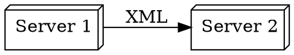

*Figure x: Conceptual SOAP interface*

## ReST (Representational State Transfer) API style


**Characteristics: **

- Resource-based for web servers
- Light-weight
- Very prevalent
- Simple
- Caches HTTP GET-requets very well
- Not optimal for real-time data
- Not optimal for highly-connected data model - multiple calls are required to get at specific data
- APIs are versioned for backwards compatibility
- Stateless
- Easy to scale
- Allows for the independent natures of clients and servers
- No built-in security
- Difficult to design a consistent URI path scheme in a complex project


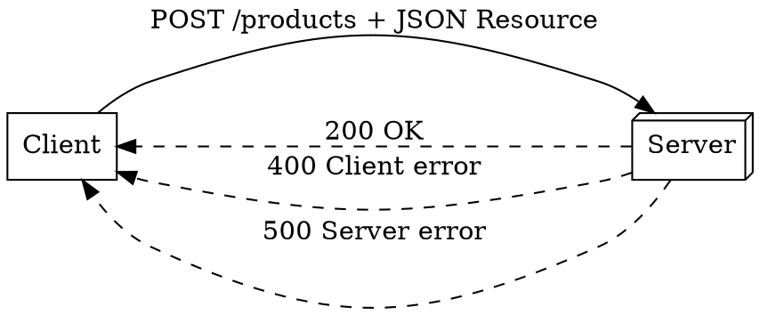

*Figure x: Conceptual ReST interface*

**ReST API Design Sanity checks:**

- URIs are in lower case
- URI words are hyphin-separated
- URI words are not file extensions
- Branches are plural nouns
- Slashes indicate hierarchy
- URI nouns and path schemes are consistently applied across project
- Resources are named after nouns ("products"), not verbs ("getProducts")
- Pagination is used to large returned datasets: /products?limit=16&offset=50
- Versioning is used : api/v3/products


**ReST CRUD Operations and Responses**

|HTTP Verb|CRUD Operation |Collection (e.g. /customers)|Item (e.g. /customers/{id})|
|---------|---------------|----------------------------|---------------------------|
|POST	  |Create	      |201 (Created), 'Location' header with link to /customers/{id} containing new ID.	|404 (Not Found), 409 (Conflict).|
|GET	  |Read	          |200 (OK), list of customers. |200 (OK), single customer. 404 (Not Found)|
|PUT	  |Update/Replace |405 (Method Not Allowed), unless you want to update/replace every resource in the entire collection.|200 (OK) or 204 (No Content). 404 (Not Found)|
|PATCH	  |Update/Modify  |405 (Method Not Allowed), unless you want to modify the collection itself.|200 (OK) or 204 (No Content). 404 (Not Found)|
|DELETE	  |Delete         |405 (Method Not Allowed), unless you want to delete the whole collection—not often desirable.|200 (OK). 404 (Not Found)|


**HTTP Status Codes**

Code|1xx Informational code
----|---------------
100 |Continue
101 |Switching Protocols
102 |Processing (WebDAV)


Code|2xx Client-side Success code
----|---------------------
200 |OK
201 |Created
202 |Accepted
203 |Non-Authoritative Information
204 |No Content
205 |Reset Content
206 |Partial Content
207 |Multi-Status (WebDAV)
208 |Already Reported (WebDAV)
226 |IM Used
 
Code|3xx Redirection code
----|-------------
300 |Multiple Choices
301 |Moved Permanently
302 |Found
303 |See Other
304 |Not Modified
305 |Use Proxy
306 |(Unused)
307 |Temporary Redirect
308 |Permanent Redirect (experimental)

Code|4xx Client-side Error code
----|-------
400 |Bad Request
401 |Unauthorized
402 |Payment Required
403 |Forbidden
404 |Not Found
405 |Method Not Allowed
406 |Not Acceptable
407 |Proxy Authentication Required
408 |Request Timeout
409 |Conflict
410 |Gone
411 |Length Required
412 |Precondition Failed
413 |Request Entity Too Large
414 |Request-URI Too Long
415 |Unsupported Media Type
416 |Requested Range Not Satisfiable
417 |Expectation Failed
418 |I'm a teapot (RFC 2324)
420 |Enhance Your Calm (Twitter)
422 |Unprocessable Entity (WebDAV)
423 |Locked (WebDAV)
424 |Failed Dependency (WebDAV)
425 |Reserved for WebDAV
426 |Upgrade Required
428 |Precondition Required
429 |Too Many Requests
431 |Request Header Fields Too Large
444 |No Response (Nginx)
449 |Retry With (Microsoft)
450 |Blocked by Windows Parental Controls (Microsoft)
451 |Unavailable For Legal Reasons
499 |Client Closed Request (Nginx)

Code|5xx Server-side Error code 
-----------|-------------------
500 |Internal Server Error
501 |Not Implemented
502 |Bad Gateway
503 |Service Unavailable
504 |Gateway Timeout
505 |HTTP Version Not Supported
506 |Variant Also Negotiates (Experimental)
507 |Insufficient Storage (WebDAV)
508 |Loop Detected (WebDAV)
509 |Bandwidth Limit Exceeded (Apache)
510 |Not Extended
511 |Network Authentication Required
598 |Network read timeout error
599 |Network connect timeout error


## GraphQL API style

**Characteristics: **

- Support "mutations" (insert/update/delete data) 
- Support "subscriptions" (client notification of a server-side data modification)
- Presents uniform client interface end-point to heterogenous backend databases through a schema
- It is also a Query Language
- Flexible query capabilities
- Able to get at very specific data in one operation
- We specify resources and required data fields in query
- No over-fetching or under-fetching of data
- Reduce network load
- Faster responses
- Steep learning curve
- More server-side processing
- More difficult to cache, does not used GET which is easy to cache, only POST
- More complex schema-based request: GET /graphql?query={book(id:"123"){title,authors{name}}  vs  GET /books/123
- Requires client-side and server-side tooling (Apollo, Postman) / libraries (schema.graphql, codegen.yml, operation.graphql)
- Can overload server with client-initiated full-table scans


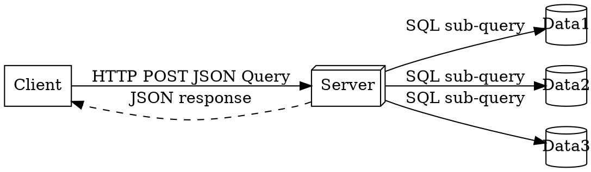

*Figure x: Conceptual GraphQL interface*

## gRPC API style


> gRPC is roughly 7 times faster than ReST when receiving data and 10 times faster when sending data. This is mainly due to the tight packing of the Protocol Buffers and the use of HTTP/2.

Application:

- Remote Procedure Call for inter-service calls
- Used for micro-services architectures
- Strongly-typed schema definition in .proto file
- Used in mobile applications
- Most modern style, preferred to standard RPC

Characteristics: 

- High performance for network services 
- Uses protocol buffers by default to encode structured data
- Protocol buffer encoding is highly efficient (5x faster than JSON)
- Uses HTTP/2
- Very limited browser support
- Toolset has wide language support


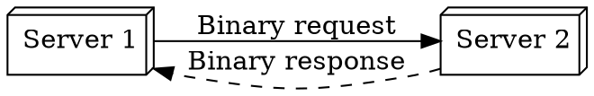

*Figure x: Conceptual gRPC interface*

### gRPC-web

> WebgRPC is a JavaScript implementation of gRPC for Web clients and sends gRPC requests directly to the server. 
> gRPC-web uses the Envoy proxy to forward gRPC requests from the client to the server.


## Websockets API style

Application:

- Synchronous communications
- Persistent connections
- Live-chat apps and real-time gaming

Characteristics: 

- Bi-directional
- Real-time
- Persistent connection
- Full-duplex TCP connection
- Low-latency data exchange


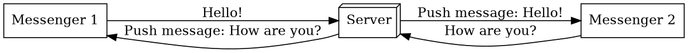

*Figure x: Conceptual Websockets interface*

### Webhooks API style

Application:

- Asynchronous for real-time event-driven applications
- Used to intergrate to external services
- When complete decouplng and resilliancy is required


Characteristics: 

- Uses HTTP
- One of few ways web apps can inter-communicate
- Signals an event
- Does not request data
- Returned data (if any) is asynchronously returned
- Decouples asynchronously to external systems using events
- Retries and failures can elegantly dealt with isolation
- Often uses a message broker for resillience and failure management


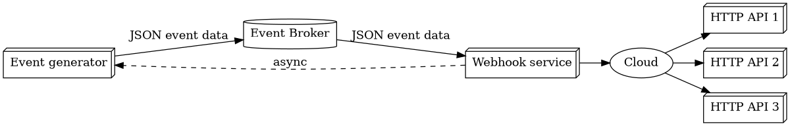

*Figure x: Conceptual Webhooks interface*

### AJAX (Asynchronous Javascript And XML)

- Collection on Web technologies
- Asynchronous requests
- Used build-in XML request object


## Database Replication Interfaces


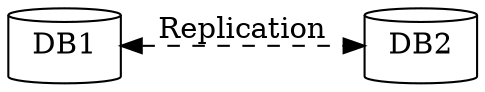

*Figure x: Conceptual Database Replication interface*

## API Performance Optimization


*[Indicate which if the following design approaches have been used to optimize the API performance, the reasons, and how the method(s) was//were applied.]*

- Cacheing to store results of extensive computations. Use Redis or MemCached where key-value pairs are used.
- Database connection pooling, to maintain a pool of open database connections instead of opening and negotiating a new DB connection on every call, as you would in a "serverless" solution.
- Fetch joined queries instead of N+1 queries. to reduce round-trips to the database
- Chunk large data up using pagination: specify which page, pagesize, number of pages per query operation
- Serialize/deserialize JSON responses: use a fast, light-weight serializer
- Compression of payloads (Brotli, Cloudflare, rRPC)

# APPENDIX B: ACCESS CONTROL CHOICES

*[Explain the authentication schemes uses for access control between components and users. Below we have the mpst popular form of authentication mechanisms:]*

The authentication and identity verification scheme should strike a balance between the  aspects below. 
Consider the different user experiences of initial sign-up and and regular loggin on.

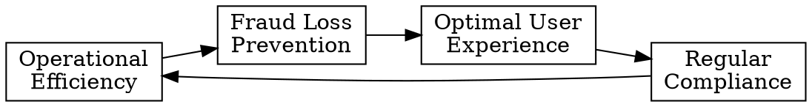
*Figure x: Balance between user experience and other aspects*


## OAUTH2 Access control between [APP] and [3rdPartyApp] for [User]

> **Summary:** Tokens that provide access to user daya on thid-party applications


[User] is already authenticated on [App] and gives [3rdPartyApp] permission to access App's resources
without exposing [User]'s authentication credentials to [3rdPartyApp]


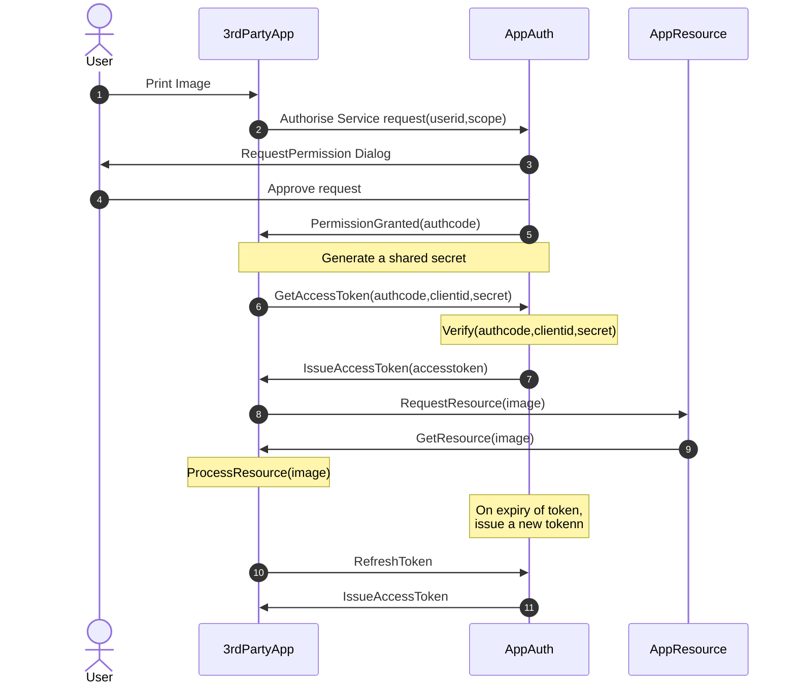


## SSH Keys

> **Summary:** Cryptographic keys are to securely access remote systems and devices


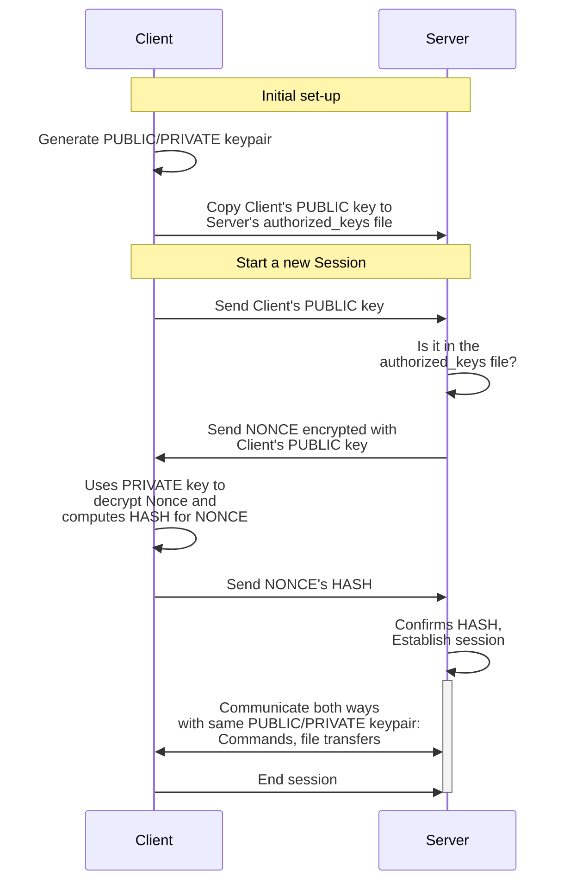

## SSL Certificates

> **Summary:**  Digital certificates ensure secure and encrypted commnication between clients and servers


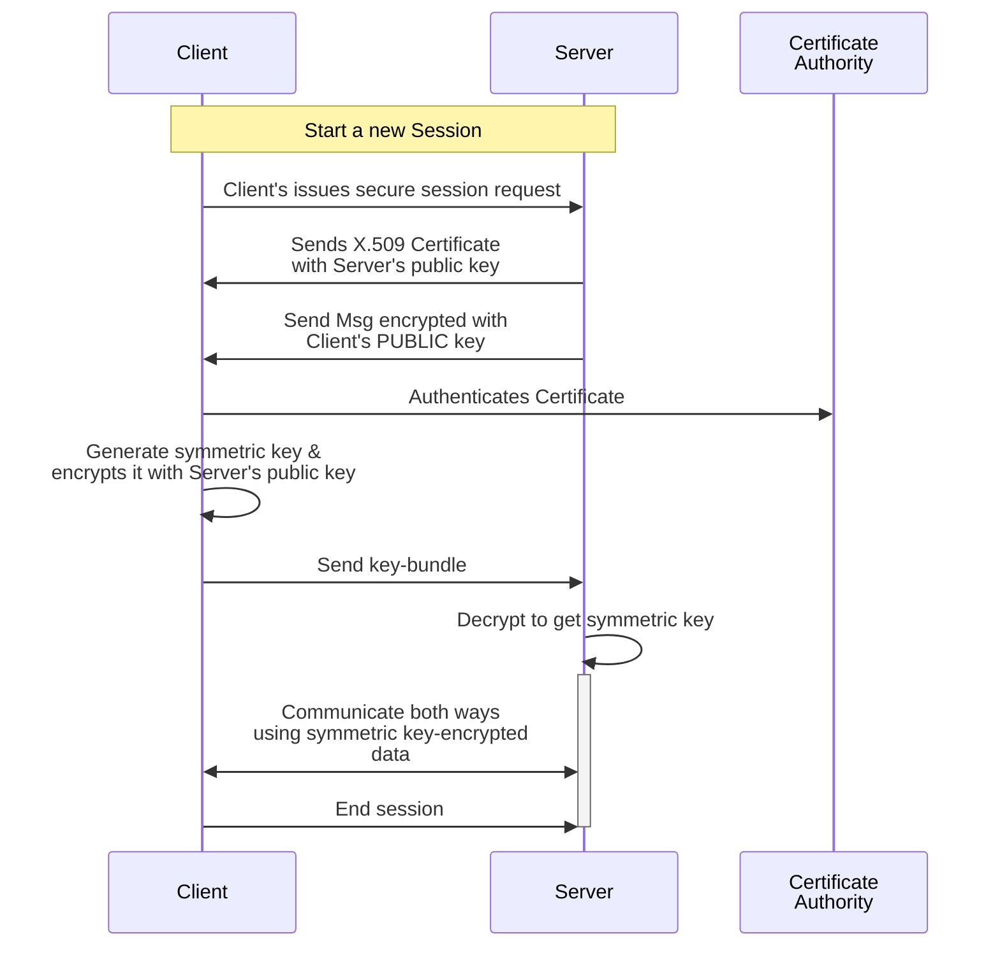

## Credentials

> **Summary:** User authentication information is used to verify and grant access to systems, devices and services.
> As a rule, we always communicate over SSL for publc network traffic..


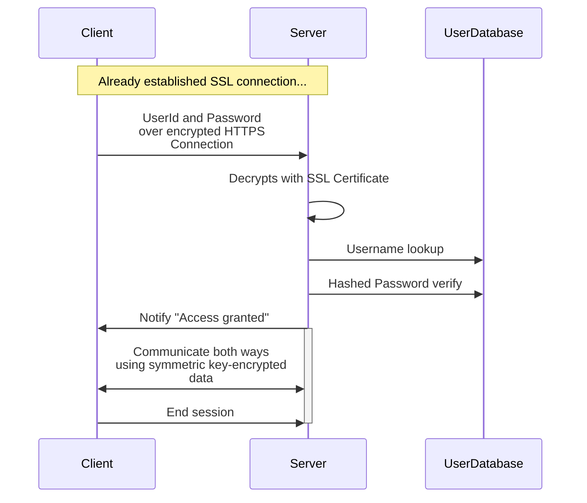


# APPENDIX C:ARCHITECTURAL PATTERN USAGE FOR A NON-DISTRIBUTED SYSTEM

*[Indicate which one of these system design patterns were used in this solution, or add your own new pattern.]*

## Layered Architecture

Provide abstraction and encaptulation with each layer having a distinct responsibility.
Allows changes in one layer to no adversely affect other layers.
A specialization of this layer is Model-View-Controller.

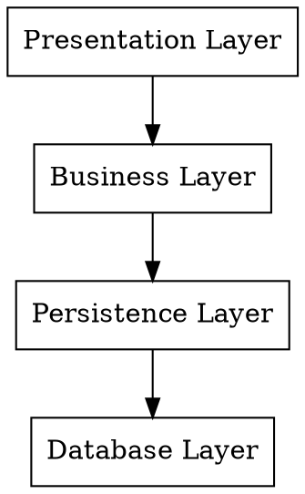

## Event-driven architecture

Promotes the production and consumption of events between loosely-coupled components.
Components do not communicate directly with the application but react to published events.


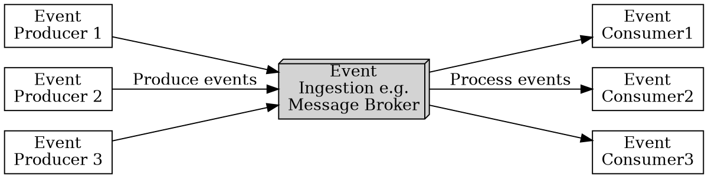


## Microkernel architecture

A code application with the ability to extend its functionality with small add-on or plug-in components.

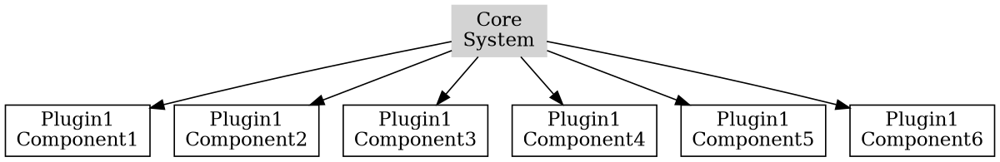


## Microservices architecure

A collection of loosely-coupled services.
Each service represents its own business functionality can contains its own datamodel and database.
Communication to the services is typically done via APIs and it promotes design modularization and agility.
The trade-off is in the management of inter-service communication and maintaining data consistency between the datamodels. 

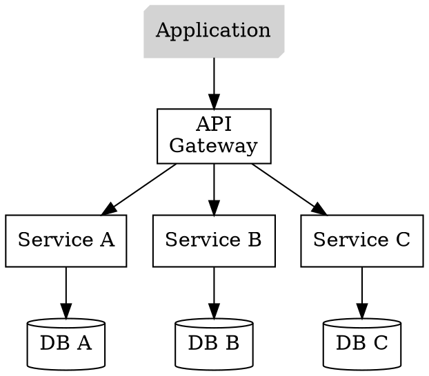


## Monolithic architecure

A single deployable unit, forms the basis for first-iteration solutions and smaller solutions. It is a middle-ground that allows refactoring the design into a microservices, microkernel or event-driven architecture.
A specialization is the modular monolith, where the boundaries between functions in the codebase are more clearly demarcated. This allows for easier maintenance and scalability.  

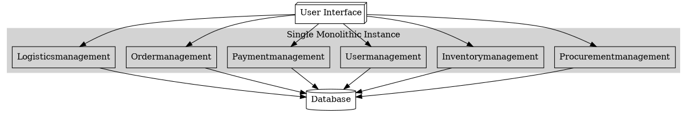

---

# APPENDIX D: ARCHITECTURAL PATTERN USE FOR A DISTRIBUTED SYSTEMS

*[Indicate which one of these system design patterns were used in this solution, or add your own new pattern.]*


## Ambassador Pattern 

Offload functions to an intermediate proxy service to run eg. logging, performance monitoring, retries, to reduce latency, enhance security and improve overall architecture (for extendibility). Example: "Envoy" proxy.

```graphviz
digraph AmbassadorPattern {
    rankdir=LR;
    size="8,5"
	ClientApp [shape = box, label="Client Application"];
	Ambassador [shape = box, label="Ambassador Service"];
	Logging [shape = box, label="Logging Service"];
	Retry [shape = box, label="Retry Service"];
	Monitoring [shape = box, label="Monitoring Service"];

	ClientApp->Ambassador;
	Ambassador->Logging;
	Ambassador->Retry;
	Ambassador->Monitoring;

}
```

## Circuit-breaker Pattern

Prevents the cascading of failures when one service in a line of dependent services fails.
Used with micro-services and cloud-based applications, where failures are more likely to occur
and allows for a graceful degradation and for the service to recover while the service/thread is isolated with a semaphore. 
See Netflix/Hystrix Library.

```graphviz
digraph CircuitProblemPattern {
    rankdir=LR;
    size="8,5"
	ServiceA [shape = box, label="Service A"];
	ServiceB [shape = box, label="Service B\nFAILED", color=grey, style=filled];
	ServiceC [shape = box, label="Service C\n(cascaded fail)", color=lightgrey, style=filled];
	ServiceD [shape = box, label="Service D\n(cascaded fail)", color=lightgrey, style=filled];

	ServiceA->ServiceB;
	ServiceB->ServiceC;
	ServiceC->ServiceD;

}
```


```graphviz
digraph CircuitSolutionPattern {
    rankdir=LR;
    size="8,5"
	ServiceA [shape = box, label="Closed"];
	ServiceB [shape = box, label="Open", color=grey, style=filled];	
	ServiceC [shape = box, label="Half-Open", color=lightgrey, style=filled];
	
    ServiceA->ServiceA[label="Success"];
	ServiceA->ServiceB[label="Failure threshold reached"];
	ServiceB->ServiceC[label="Open on timeout/\nAttempt reset"];
	ServiceC->ServiceB[label="Failure"];
	ServiceB->ServiceB[label="Still failing"];
	ServiceC->ServiceA[label="Success"];
}
```

## CQRS Command Query Responsibility Segragation

Separating "read" and "write" operations to storage, by hosting separate storages,
each best-configured for their respective reading or writing operations. 
A separate service keeps the two storages consistent, with an accepted latency. This is often a message queue with a publisher / subscriber implementation.

```graphviz
digraph CQRSPattern {
    rankdir=LR;
    size="8,5"
	Client [shape = box, label="Client"];
	UI [shape = box, label="UI"];
	Command [shape = box, label="Command", color=grey, style=filled];
	Query [shape = box, label="Query", color=grey, style=filled];
	
	WriteDB [shape = cylinder, label="Write\nDatabase\n(e.g. tables)"];
	ReadDB [shape = cylinder, label="Read\nDatabase\n(e.g. materialized\nview)"];
	
    Client->UI[label="browses shopping\n& writes orders"];
	
	UI->Command [label="Reads shopping\nwrites orders"];
	ReadDB->Query;
	Command->WriteDB;
	Query->UI [label="Reads shopping\nwrites orders"];
	ReadDB->WriteDB [label="Eventual\nconsistency", style="dashed"];
}
```

## Event Sourcing

New state-representing event record for every new state change, instead of updating the same record.
Useful for retrospecive debugging.

## Leader Election

Provide a failover of the one and only one active leader service.
Avoids conflicts and consistent decision making.
Example: Apache Zookeeper and etcd.

## Publisher / Subscriber

Implemented using a message queue component.

**Characteristics:**

- Services emit events and listeners listen for events that they are interested in.
- Useful for propagating changes to multiple components.
- Better independent component scalability by decoupling event senders and receivers
- Loosely coupling between components, resulting in better system modularity
- Fault tolerant systems


**Message Queue implementation choices:**

### IBM Message Queue

- Basic
- Still used in legcy systems
- Persistent and non-persistent queues
- No message acknowlegement
- No streaming

### RabbitMQ

- Flexible & dynamic model
- Multiple messaging protocols AMQP, MQTT, STOMP
- Routing, queueing, publisher-subscriber features
- Allows extending functionality
- Clustering, load distribution, high avilability
- Content-based routing
- Message acknowlegement
- No streaming

### Kafka

- High throughput, real-time data streaming, high volume
- Scalable
- Fault tolerant
- Partinioned architeture, distributed commit log
- Horizontal scaling 
- High availabilty
- High data durability
- Replication
- Message replay a.k.a. "Time travel"

### Pulsar

> More performant than Kafka

- Cloud-native
- Multi-tenancy support
- Tiered storage - allows cheap access to historical data
- Geo-replication - good for DR and Data Locality
- Stream processing
- Many IO connectors fo interfacing
- Message replay a.k.a. "Time travel"
- No Enterprize commercial backing yet


## Sharding

Split a storage service up into separate services. This feature is built in to MongoDB and Cassandra DB.
Reduces network latency, speeds up qury execution, better data locality, 

```graphviz
digraph CQRSPattern {
    rankdir=LR;
    size="8,5"
	OriginalDB [shape = cylinder, label="Original\DB"];
	Shard1 [shape = cylinder, label="Shard\nA-F"];
	Shard2 [shape = cylinder, label="Shard\nG-M"];
	Shard3 [shape = cylinder, label="Shard\nN-Q"];
	Shard4 [shape = cylinder, label="Shard\nR-Z"];

	OriginalDB->Shard1;
	OriginalDB->Shard2;
	OriginalDB->Shard3;
	OriginalDB->Shard4;
}
```


## API-Interfaced Cloud-based solution

```graphviz
digraph APICloudSolutionPattern {
    rankdir=LR;
    size="8,5"
	APIGateway [shape = box, label="API\nGateway\nImplementation"];
	ClientApp [shape = box, label="Client App"];
	ClientCache [shape = cylinder, label="Client-side\ncache"];
	LB [shape = box, label="Load\nBalancer"];
	ServiceA [shape = box, label="Service A"];
	ServiceB [shape = box, label="Service B"];
	LBCache [shape = cylinder, label="Cache"];
	Redis [shape = box, label="Redis"];
	Elastic [shape = box, label="elastic"];
	Kafka [shape = box, label="kafka"];
	InMemCache [shape = cylinder, label="In Memory\nCache"];
	CDN [shape = box, label="Content\nDelivery\nNetwork"];
    CDNStaticData [shape = cylinder, label="Static\nData"];
	DB1 [shape = cylinder, label="DB1"];
	DB2 [shape = cylinder, label="DB2"];
	IndexedData [shape = cylinder, label="Indexed\nData"];
	MessageCache [shape = cylinder, label="Message\nCache"];	


    subgraph cluster_Client {
		label = "Client";
		style=filled;
		color=lightgrey;		
		ClientApp;
		ClientCache;		
	}
	
	subgraph cluster_CDN {		
		label = "CDN";
		style=filled;
		color=lightgrey;
		node [style=filled,color=white];		
		CDN;
		CDNStaticData;		
	}

	subgraph cluster_LOAD {		
		label = "Load Balancer";
		style=filled;
		color=lightgrey;
		node [style=filled,color=white];				
		LB;
		LBCache;		
	}

	subgraph cluster_API {
		label = "API Gateway";
		style=filled;
		color=lightgrey;
		node [style=filled,color=white];		
		APIGateway;
	}

	subgraph cluster_DCache {
		label = "Distributed Cache";
		style=filled;
		color=lightgrey;
		node [style=filled,color=white];		
		Redis;
		InMemCache;
	}

	subgraph cluster_FullText {
		label = "Distributed Cache";
		style=filled;
		color=lightgrey;
		node [style=filled,color=white];		
		Elastic;
		IndexedData;
	}


	subgraph cluster_MessageBroker {
		label = "Message\nBroker";
		style=filled;
		color=lightgrey;
		node [style=filled,color=white];		
		Kafka;
		MessageCache;
	}


	ClientApp->CDN;
	ClientApp->LB;
	LB->APIGateway;
	APIGateway->ServiceA;
	APIGateway->ServiceB;
	APIGateway->Redis;
	APIGateway->Elastic;
	APIGateway->Kafka;
	ServiceA->DB1;
	ServiceB->DB2;
}
```


# APPENDIX F: SCALABILLITY CONSIDERATIONS IN THE DESIGN

This appendix shows the workings and consideration in the design to ensure future scalability, such that the system is able to handle the increased workload without loosing performance.


## Anticipated growth

*[Show how the computational and storage requirements will increase as input load grows, based on the anticipated complxity estimate curve. Bear in mind that there will always be a limit to the ability to scale a system. If that limit will be reached well within the expected lifespan of the system, then the system should be redesigned. If relevant, also show how the system can dynamically be scaled when it encounters unexpected user demand, such as what a box office service might occasionally encounter when Taylor Swift tickets go on sale.]*

### Completixy estimates with Big O notation

Decide how the growth of business entities (events, users, documents, assets etc...) will affect the solution's computational load.

- **O(1) - Constant time notation**, when the runtime remains steady regardless of input size. 

*Example:* Access an element in an array by index and inserting/deleting an element in a hash table. 

- **O(n) - Linear time notation**, when the runtime grows in direct proportion to the input size. 

*Example:* Find the max or min element in an unsorted array. 

- **O(log n) - Logarithmic time notation**, when the runtime increases slowly as the input grows. 

*Example:* A binary search on a sorted array and operations on balanced binary search trees. 

- **O(n^2) - Quadratic time notation**, when the runtime grows exponentially with input size. 

*Example:* A simple sorting algorithms like bubble sort, insertion sort, and selection sort. 

- **O(n^3) - Cubic time notation**, when the runtime escalates rapidly as the input size increases. 

*Example:* Multiply two dense matrices using the naive algorithm. 

- **O(n logn) - Linearithmic time notation**. This is a blend of linear and logarithmic growth. 

*Example:* Efficient sorting algorithms like merge sort, quick sort, and heap sort 

- **O(2^n) - Exponential time notation**. The runtime doubles with each new input element. 

*Example:* Recursive algorithms solve problems by dividing them into multiple subproblems. 

- **O(n!) - Factorial time notation**, when the runtime "skyrockets" with input size. 

*Example:* Permutation-generation problems, social media re-sharing.

- **O(sqrt(n)) - Square root** time notation, when the runtime increases relative to the input's square root. 

*Example:* Search within a range such as the Sieve of Eratosthenes for finding all primes up to n. 

## Design strategies

### Avoid tight coupling between components

List exceptions where there is tight coupling, what, if any, workarounds were applied in the design, and how that may or may not affect future scalability

### Avoid the use of contralized components

List exceptions where contralized components were used, what, if any, workarounds were applied in the design, and how that may or may not affect future scalability

### Avoid the use of high latency components

List exceptions where high latency components were used, what, if any, workarounds were applied in the design, and how that may or may not affect future scalability

## Techniques to scale computing

Load balancing

Caching

Event-drive architecture


## Strategies to scale network usage

## Strategies to scale storage

## Strategies to scale database

*[Which of the following strategies were used in the design to scale this?]*

### Indexing

> Mostly fine-tuned in the course of running the solution

- Avoid full table scan by picking the best columns to index on
- Small tables cn someties be faster if they are not indexed 
- Indexing can slow down write operations - find the the right balance

### Denormalization

> Hugely improves the user experience on large systems

> Useful strategy for social media platforms

- Reduce complex joins between tables by duplicating data at write-time in tables that would otherwise be joined
- Updates must be carefully managed to maintain consistency of data across the database
- Accept the cost of data only eventually becoming consistent across the database.


### Caching

- Store more frequently-accessed data on faster storage
- Execute more frequently-run queries and its data on faster memory-only databases
- Can be implemented on an application level or on the middle-ware level.
- Cache needs to remain up to date with the most recent data - explain how the cache invalidation works:
  - Cache is refreshed on a time-basis 
  - Cache is refreshed on an event


### Replication

> Added benefit: enhances fault tolerance

- Master database content is replicated to slave databases
- Synchronous replication: Immmediate consistency but introduces latency
- Asynchronous replication: Zero-cost, but introduces temporary data inconsistency between master and slave serverss

### Sharding

- Each shard is a database that contains a seperate part of the data
- Reduces workload on ondividual each server
- Effective horizontal scaling approach
- Need to choose sharding key carefully
- Introduces more complexit
- May require changes to application CRUD queries
- Adding shards can be challenging

```mermaid
architecture-beta
    group sys(cloud)[Basic solution]
	    service db(database)[A to Z] in sys
	group sys2(cloud)[Sharded solution]
		service db1(database)[A to H] in sys2
		service db2(database)[I to P] in sys2
		service db3(database)[Q to Z] in sys2
		junction j  in sys2

		db:B -- T:j
		j:B -- R:db1
		j:B -- T:db2
		j:B -- L:db3
```


### Vertical Scaling

> This is often the first step in scaling a database since it is easy to implement and does not affect the solution architecture, although it has limitations.

- Add more resources to the databasse server by adding more CPUs, RAM or storage
- Balance vertical scaling with getting an additional load-balanced database server for the added benefit of getting failover redundancy in the design.

### Materilized Views

> Useful in BI

**Benefits:**
- Avoid the recalculation of values and aggregates by storing the computed values and aggregates in the database and recuding the cpmputational load on the database
- Need to be periodically refreshed to remain up-to-date, which can be resource intensive and time consuming. 
- Balance the cost of refreshing materialized views with the required refresh frequency
   

# APPENDIX G: API GATEWAY CONFIGURATION

*Include this Appendix if the solution uses an API Gateway.]*

## Conceptual architecture of an API Gateway

```graphviz
digraph APIPattern {
    rankdir=LR;
    size="8,5"

	C1 [shape = box, label="Client App\nA"];
	C2 [shape = box, label="Client App\nB"];
	C3 [shape = box, label="Client App\nC"];
	API [shape = box, label="API\nGateway"];
	S1 [shape = box, label="API Service\nA"];
	S2 [shape = box, label="API Service\nB"];
	S3 [shape = box, label="API Service\nC"];

	C1->API
	C2->API
	C3->API
	API -> S1
	API -> S2
	API -> S3
}

```

## Reasons to have an API Gateway

- Isolate yourself when consuming public API services
- Provide an authentication layer to hosted APIs, which is especially for APIs consumed by the public
- Provide consistent API frontend to a group of heterogenuous API services on the back end
- Central location to secure, throttle, route and monitor all API network traffic
- Central location to monitor and report on API usage
- Acts as load balancer to API services for scaling and performance improvement
  
Also:
- Feature payment barriers with membership control and consumption measurement for publically traded API services

## Options

- Amazon API Gateway
- Goodle APIGEE API Gateway
- Azure API Gateway
- Kong API Gateway
