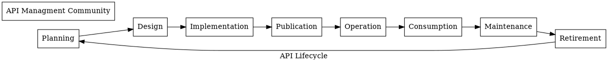
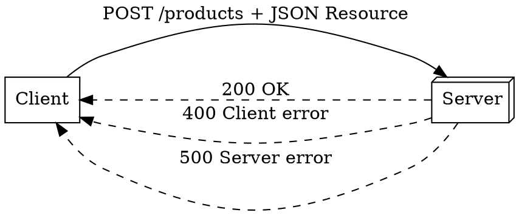
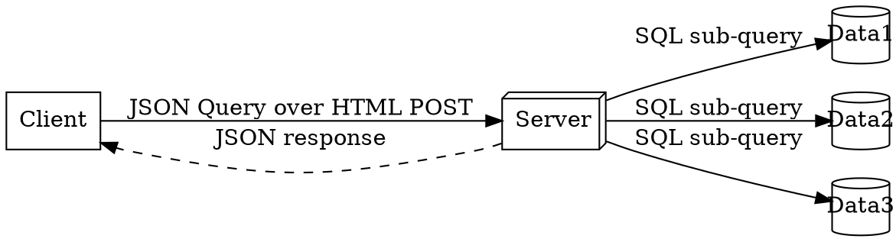
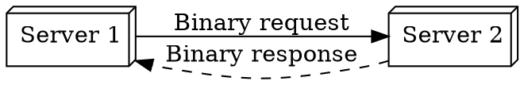
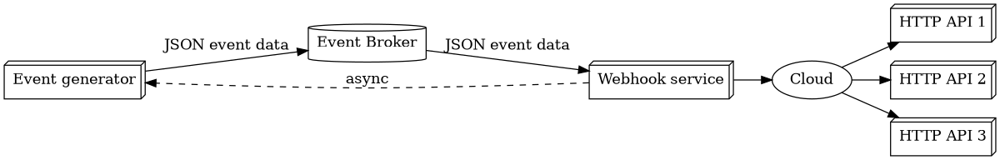
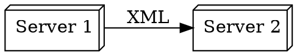
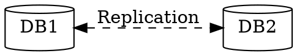
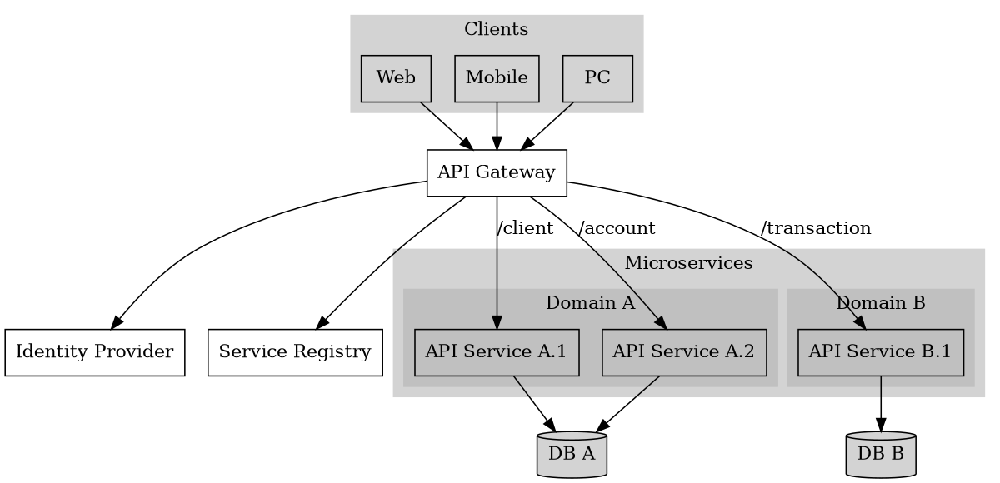

# The Importance of API Strategy in Modernizing Business Systems

## The problem Scenario

An organizatoin with legacy systems that suffer capacity and performance duress and are not alligned with the current business processes needs to undergo a digital transformation to remedy this situation. 

Many activities to effect such a digital transformation ensue, and one key activity is to introduce an API-based architecture to the solution. This will allows a robust yet flexible interconnectivety fabric between system components, which lets legacy components gradually be modernized, combined or split up, with minimal risk and online impact.

For APIs to become an effective key enabler in the digital transformation journey, a strategy on API implementation needs to be decided on first.

# Contents

Intro to API: 
- What is an API? 
- What are the visionary leaders already doing? 
- The impact of API usage so far

API Strategy: 
- Why is an API Strategy important at all?
- How do we go about implementing an API Strategy?

Dig-down into APIs:
- Top API Architecture Styles and older API styles
- API Gateway - What is it?

Conclusion:
- Examples
- What else makes APIs adoption so attractive
- Traps

# But first: What is an API?

Simple analogy: Like a door, at a particular address and a secure key, it provides access to specific functions 

- APIs are now the cornerstone of modern, agile enterprise systems. 
- Eable access to enterprise services from a wide variety of devices
- They can serve different communities, e.g. public-facing, or just for internal use
- Does so with ease and securely
- Act as a platform for innovation, and open completely new revenue streams. 
- Provide a strategy to organize and manage complexity in system design
- Route to deliver digital capabilities
- Form the connective "fabric" in digital transformations
- Facilitates communications & information exchanges between systems
- Lets us make sense and exploit the hyperconnectedness of our world
- Allows adaption to changing market conditions and business changes

... if designed well and if used correctly

## What the visionaries are already doing

Embraced the adoption of APIs:

- "API First" cultural and mindset change in organizations
- "API Management" is a new technical discipline
- Have a "prosperous" API landscape
- APIs are the centre of their digital ecosystems
- APIs become the backbone of a company
- Have experienced the value that APIs delivers
- Recognized the Change or die threat

## Already observed Impact of API usage

Disruption is mostly seen in the B2C industries, mostly driven by smartphones.

In descending order:

- Media 
- Communications
- Financial Services
- Retail
- Technology
- Consumer products
- Education
- Healthcare
- Industrial

# Why is an API Strategy important at all?

- It is an enabler for disruptive innovation (the "challengers") and sustaining innovation (the "incumbents")
- Allows both Stable IT ("hard-to-change" IT) and Agile IT (non-linear, exploratory IT) to co-exist on an estate (a.k.a. "bimodal" IT)
- Avoid an uncontrolled hyperconnected mess between components with no clear lines of accountability, by layering APIs into a federated collection of APIs
- Provides a monetization opportunity
- Regulatory compliance is achieved through strong security and correct access to data for the compliant reasons, with auditability
- Make the implementation of industrial or government-mandated interoperability  initiatives possible, e.g:

  -  Open Banking API
    The Open Banking API aims to promote competition between financial institutions and therefore more consumer choices, by securely sharing data between each other using this API.

  - Fast Heathcare Interoperability Resource (FHIR)
    This replaces the legacy Health-Level 7 (HL7) standard for securely sharing medical data

# How do we go about implementing an API Strategy?

## Stakeholder Buy-in

The basis of a sucessfully-implemented API Strategy relies on building on:

- Business
- Organization
- Technology

People responsible for each pillar need to buy into the API vision, understand the role and importance of APIs, and be part of the high-level API strategy plan

## Plan the API life-cycle

Manage APIs and microservices through the complete life cycle:
- Articulate the digital business goals
- Select a methodology used to deliver APIs for best business value
- Provide the tools and skills to develop the APIs
- Choose between REST, GraphQL, and gRPC-style API architectures
- Design the API first before coding it
- Publicize the APIs by making them discoverable

Embrace DevOps strategies to deploy APIs.
- Automate testing and validation processes
- Automate deployment and cutovers

Generally:
- Focus on delivering business capabilities
- Define roles, skills and owners for managing the APIs
- Keep the future in mind and recognize when new investment is required due to business or technology evolution, or when the API needs to be retired
- Review and challenge assumptions
- Use language-independent specification standards such as OpenAPI (for HTTP APIs only)
- Always use an API Gateway(s)

# Top API Architecture Styles

## REST

Characteristics: 

- Resource-based for web servers
- Light-weight
- Very prevalent
- Simple
- Not optimal for real-time data
- Not optimal for highly-connected data model - multiple calls are required to get at speific data
- API end-points are named after nouns ("products"), not verbs ("getProducts")
- Large volumes are paginated
- APIs are versioned

## ReST CRUD Operations and Responses

|HTTP Verb|CRUD Operation |Collection (e.g. /customers)|Item (e.g. /customers/{id})|
|---------|---------------|----------------------------|---------------------------|
|POST	  |Create	      |201 (Created), 'Location' header with link to /customers/{id} containing new ID.	|404 (Not Found), 409 (Conflict).|
|GET	  |Read	          |200 (OK), list of customers. |200 (OK), single customer. 404 (Not Found)|
|PUT	  |Update/Replace |405 (Method Not Allowed), unless you want to update/replace every resource in the entire collection.|200 (OK) or 204 (No Content). 404 (Not Found)|
|PATCH	  |Update/Modify  |405 (Method Not Allowed), unless you want to modify the collection itself.|200 (OK) or 204 (No Content). 404 (Not Found)|
|DELETE	  |Delete         |405 (Method Not Allowed), unless you want to delete the whole collection—not often desirable.|200 (OK). 404 (Not Found)|

## GraphQL

Characteristics: 

- Support "mutations" (insert/update/delete data) 
- Support "subscriptions" (notification on a data modification)
- Presents uniform client interface end-point to heterogenous backend databases through a schema
- It is also a Query Language
- Flexible query capabilities
- Able to get at very specific data in one operation
- We specify resources and required data fields in query
- No over-fetching or under-fetching of data
- Reduce network load
- Faster responses
- Steep learning curve
- More server-side processing
- Required heavier tooling support (Apollo, Postman)
- More difficult to cache

## gRPC

Application:

- Remote Procedure Call for inter-service calls
- Used for micro-services architectures
- Strongly-typed schema definition in .proto file
- Used in mobile applications
- Most modern style, preferred to standard RPC

Characteristics: 

- High performance for network services 
- Uses protocol buffers by default to encode structured data
- Protocol buffer encoding is highly efficient (5x faster than JSON)
- Uses HTTP/2
- Very limited browser support
- Toolset has wide language support

## Websockets

Application:

- Synchronous communications
- Persistent connections
- Live-chat apps and real-time gaming

Characteristics: 

- Bi-directional
- Real-time
- Persistent connection
- Full-duplex TCP connection
- Low-latency data exchange

## Webhooks

Application:

- Asynchronous for real-time event-driven applications
- Used to intergrate to external services
- When complete decouplng and resilience is required

Characteristics: 

- Uses HTTP
- One of few ways web apps can inter-communicate
- Signals an event
- Does not request data
- Returned data (if any) is asynchronously returned
- Decouples asynchronously to external systems using events
- Retries and failures can elegantly dealt with isolation
- Often uses a message broker for resillience and failure management

# Older API Architecture Styles

## SOAP

Characteristics: 

- XML-based for enterprise applications
- Mature, but complex and verbose
- Used in Financial Services, payment gateways, and other enterprise services
- Complex and verbose - overkill for lightweight and mobile applications

## Database Replication Interfaces

## Legacy API Styles:

- CORBA (Common Object Request Broker Arch.)
- DCOM (Distributed Common Object Model)
- RPC (old UNIX-style)
- WSDL (Web Service Description Language)
- EDI (Electronic Data Interchange)

#  API Gateway - What is it?

API Gateway Features:
* Authentication using API key methods
* Security policy enforcement
* Protocol translation, reformat responses
* Service Discovery
* Monitoring, Logging, Analytics and reports
* Throughput rate limit and spike arrest 
* Quota control
* Cacheing
* Dynamic routing, load balancing and redundancy
* Error handling and overload "circuit breaking" 
* Billing (if paid-for / monetised API)

Also provides:
* Adminstrator facade
* API Design environment
* API Application environment
* API Management environment

Vendors:
- Google Apigee
- Oracle Apiary
- AWS API Gateway
- Azure API Gateway
- Cloudflare API Gateway
- RedHat Openshift
- Salesforce Mulesoft

## Implementation Pattern using an API Gateway

* Client API calls are HTTP-based ReST, GraphQL, etc.
* API Gateways transform API call to required protocols for service, e.g. gRPC
* Implemented on a regional basis for best availability, close to clients

# Examples

## eBay

History:

- Launched the first public API on inception
- APIs allowed access to most of the information and functions on eBay

Reached users that they perhaps would not have reached otherwise, and encouraged user to innovate new solutions around the eBay platform. 60% of eBay's revenue is now through monetized APIs.

## Netflix

History:

- Was a monolithic application.
- Created a ReST-style API-based microservice architecture, with all components having direct access to all services
- Too many paths to the microservices! Not a unified front to the clients!
- Introduced a ReST API gateway aggregation layer
- Grew too complex! The gateway aggregation layer became the new monolith!
- Introduced a GraphQL API-slyle federated gateway with access to smaller API gateways
- Transactions completed in a single round-trip
- Route complex business logic to appropriate services

Keypoint:

- Architecture evolves: Monolith -> Service-Oriented -> Microservices -> Federation of Microservices

# What else makes APIs adoption so attractive

- Low cost of entry
- Reduces overall development costs through re-use of patterns in API design, and reuse of the actual APIs in solutions.
- Easily and succinctly documented, hence increased visibility
- Analytics on API usage are available for business insights
- Development iteration of an API is usually only one cycle
- Easily versioned

# Traps

- Purchasing an expensive API solution that has a vendor lock-in
- Lack of product ownership of API: just building it is not enough
- Not maintaining it as business needs change
- Insufficient skills to manage API
- Under-estimating the cost and risks of transforming the business from legacy interfaces to APIs
- Over-engineering a simple solution to become an API'ed monolith
- Insufficient layers of APIs in highly complex systems 
- Loosing sight of business goals and implementing too many business channels at once, just because the API to realize it available
- Don't replicate others - focus on our unique needs 
- Don't over-optimize for problems we don't have or will never have 
- The best architecture is the one that fits our business needs, not the one that mimics the tech giants.
- API is an evolving paradigm - anticipate a shift approach.